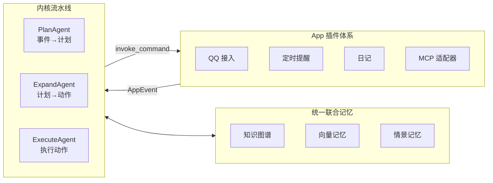

  

<h1 align="center">AuroraBot</h1>

  <em>一个本地运行的、自循环、自规划的“数字生命”</em>

  
  
  

---

## 她是什么

AuroraBot 不是一个普通的聊天机器人，而是一个在本地环境中持续运行的**自循环、自规划的数字生命**。

她由三层协作者构成：

- **感知与执行层** — 通过可插拔的 App 插件体系接入外部世界
- **认知与决策层** — 多 Agent 流水线持续消费事件、生成计划、编排动作
- **记忆与演化层** — 基于图的统一联合记忆系统，让每一次交互都成为演化的养分

> 她不是在“等待指令”，而是在“持续观察、自主决策、主动行动”。

## 亮点架构

### 高度解耦的 App 插件体系

每个 App 都是独立的感知器与执行器，通过统一的 `PlatformAPI` 与宿主交互。接入 QQ、定时器、文件系统、甚至外部 API——都只需要一个 App。

### 多 Agent 自循环的认知-决策-行动框架

内核不依赖单一“超级 Agent”，而是将认知过程拆分为多个独立阶段：

| 阶段           | 职责                           |
| -------------- | ------------------------------ |
| `PlanAgent`    | 从事件队列中识别意图，生成计划 |
| `ExpandAgent`  | 将计划展开为可执行的原子动作   |
| `ExecuteAgent` | 调用 App 命令，执行并回写结果  |

每个心跳周期内，调度器按优先级选择一个 Agent 执行一步，自然形成自循环。

### 基于图的统一联合记忆系统

AuroraBot 的记忆不只是“存下来”，而是**结构化地生长**。知识图谱、向量检索与情景记忆融合为一个统一记忆层，让每一次事件、每一次决策都参与记忆演化。

## 计划中的 MCP 适配容器

我们正在设计一个 **MCP (Model Context Protocol) 适配容器**，让任意 MCP 服务器以 App 形态接入 AuroraBot。

这意味着：

- 任何遵循 MCP 协议的工具都可以成为 AuroraBot 的能力延伸
- MCP 工具会被自动映射为内核可调用的命令
- 内核流水线无需感知 MCP 协议细节，由适配容器统一处理

> 让 MCP 生态成为你的数字生命的一部分。

## 快速导航

完整的架构设计、使用指南与开发文档请 **[访问 AuroraBot 文档站 📖](https://jufirex.github.io/AuroraBot/)**：

| 文档                                                                                  | 说明                                  |
| ------------------------------------------------------------------------------------- | ------------------------------------- |
| [项目总览](https://jufirex.github.io/AuroraBot/start/overview.html)                   | 快速了解 AuroraBot 的定位与分层       |
| [快速开始](https://jufirex.github.io/AuroraBot/start/getting-started.html)            | 从零把项目跑起来                      |
| [系统架构总览](https://jufirex.github.io/AuroraBot/architecture/system-overview.html) | 理解 App / Platform / Kernel 三层边界 |
| [内核流水线](https://jufirex.github.io/AuroraBot/architecture/kernel-pipeline.html)   | 深入多阶段 Agent 编排模型             |
| [平台运行时](https://jufirex.github.io/AuroraBot/architecture/platform-runtime.html)  | 理解宿主与 App 的运行时关系           |
| [App 开发指南](https://jufirex.github.io/AuroraBot/guide/app-development.html)        | 开发你自己的 App                      |
| [AUR CLI 路线图](https://jufirex.github.io/AuroraBot/roadmap/aur-cli.html)            | 查看未来规划                          |

## 开源致谢

AuroraBot 站在众多优秀开源项目的肩膀上构建：

| 项目                                              | 说明                     | 开源协议                                                                            |
| ------------------------------------------------- | ------------------------ | :---------------------------------------------------------------------------------- |
| [NoneBot2](https://github.com/nonebot/nonebot2)   | 跨平台 Python 机器人框架 | [MIT License](https://github.com/nonebot/nonebot2/blob/master/LICENSE)              |
| [LiteLLM](https://github.com/BerriAI/litellm)     | 统一 LLM API 调用层      | [LICENSE](https://github.com/BerriAI/litellm/blob/litellm_internal_staging/LICENSE) |
| [mem0](https://github.com/mem0ai/mem0)            | 智能体记忆基础设施       | [Apache License 2.0](https://github.com/mem0ai/mem0/blob/main/LICENSE)              |
| [ChromaDB](https://github.com/chroma-core/chroma) | 开源向量数据库           | [Apache License 2.0](https://github.com/chroma-core/chroma/blob/main/LICENSE)       |
| [OneBot](https://github.com/botuniverse/onebot)   | 统一聊天机器人接口标准   | [MIT License](https://github.com/botuniverse/onebot/blob/main/LICENSE)              |
| [VitePress](https://github.com/vuejs/vitepress)   | 文档站生成框架           | [MIT License](https://github.com/vuejs/vitepress/blob/main/LICENSE)                 |

特别感谢 **[MaiBot](https://github.com/MaiM-with-u/MaiBot)** 为本项目提供架构灵感与设计参考。

## 许可证

本项目使用 [Apache License 2.0](./LICENSE) 协议开源。

---

  Built with ❤️ by <a href="https://github.com/JuFireX">JuFireX</a>

