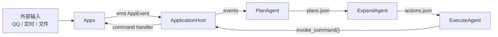
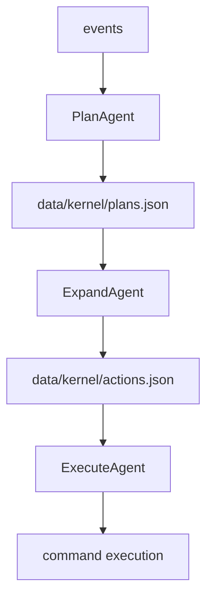

# AuroraBot

AuroraBot 是一个基于 NoneBot 的本地智能体实验项目。

它把系统拆成两层：

- `platform`
  - 负责加载应用、注册命令、维护事件队列
- `kernel`
  - 负责消费事件、生成计划、展开动作、执行命令

当前项目已经从“单体 agent 直接处理事件”的模式，切换到了“多 stage agent 协作的内核流水线”。

## 这项目现在是什么

当前 AuroraBot 更像一个“智能体运行时框架”，而不是单一聊天机器人。

它提供：

- 一个应用宿主层：让 `apps/*` 以统一方式接入
- 一个内核编排层：把事件转成计划，再转成动作
- 一套本地持久化数据目录：便于观察和调试中间状态

## 当前架构一眼图



## 核心概念

### 1. App

`apps/*` 目录下的每个应用都可以：

- 暴露命令
- 响应生命周期
- 持久化自己的私有数据
- 向宿主发事件

典型示例：

- `apps/alarm`
- `apps/diary`
- `apps/qq`
- `apps/example`

### 2. Platform

`src/platform` 是宿主层。

它负责：

- 发现应用
- 加载 manifest
- 注册命令
- 注入 `PlatformAPI`
- 维护 `AppEvent` 队列
- 执行 app 的命令处理函数

### 3. Kernel

`src/brain/kernel` 是官方维护的内核编排层。

它负责：

- 从宿主读取事件
- 生成中间计划
- 把计划展开成动作
- 执行动作并回写结果

内核内部并不是一个“万能 agent”，而是多个按阶段分工的 agent。

## 当前内核工作流

当前最小闭环是：

```text
events -> plans -> actions -> execution
```

对应三个内部 stage agent：

- `PlanAgent`
  - 从事件队列生成 `plans.json`
- `ExpandAgent`
  - 从 `plans.json` 生成 `actions.json`
- `ExecuteAgent`
  - 从 `actions.json` 调用命令

### 阶段职责图



## 目录速览

```text
AuroraBot/
  apps/                  # 应用层
  docs/                  # 文档
  src/
    brain/
      agents/            # 内核内部 stage agents
      kernel/            # 内核编排层
    platform/            # 应用宿主层
    main.py              # 启动入口
    config.py            # 全局配置
  data/                  # 运行时数据
  logs/                  # 日志
```

## 现在能看到哪些数据

运行时主要会看到这些目录：

- `data/app_data/*`
  - 各 app 的私有数据
- `data/kernel/plans.json`
  - 内核的 plan 队列
- `data/kernel/actions.json`
  - 内核的 action 队列
- `data/queues/events.json`
  - 宿主事件队列快照
- `logs/aurora.log`
  - 运行日志

## 如何启动

### 环境准备

- Python 3.14
- `uv`
- NoneBot 相关依赖

### 安装依赖

```bash
uv sync
```

### 启动项目

```bash
uv run .\bot.py
```

### 常见运行模式

通过环境变量 `RUN_MODE` 控制：

- `app`
  - 只启动应用循环
- `agent`
  - 只启动内核循环
- `prod`
  - 同时启动应用循环和内核循环

## 应用开发方式

一个 app 通常由这些文件组成：

- `manifest.yaml`
- `runtime.py`
- `config.example.json`
- `README.md`

应用通过 `PlatformAPI` 使用宿主能力，例如：

- `emit_event()`
- `register_command()`
- `post_intention()`
- `log()`
- `data_dir`

如果你要看最小示例，优先看：

- `apps/example`

## 这个项目当前适合做什么

当前 AuroraBot 适合：

- 实验多阶段内核编排
- 实验事件驱动的 app 架构
- 调试计划队列和动作队列
- 逐步接入规则 agent、记忆 agent、LLM agent

## 当前限制

目前仍然处于“内核最小骨架”阶段，已知限制包括：

- `ExpandAgent` 还是启发式展开，不是正式 planner
- 还没有 `content_builder_agent`
- 还没有 `memory_agent`
- 还没有正式的会话路由层
- 中间队列目前采用 JSON 文件持久化，更偏调试形态

## 建议阅读顺序

- 项目总览：`README.md`
- 内核设计：`docs/KERNEL_ARCHITECTURE_PLAN.md`
- 平台与应用架构：`docs/PLATFORM_APP_ARCHITECTURE.md`
- App 开发：`docs/APP_DEVELOPMENT_GUIDE.md`

## 后续演进方向

当前推荐的演进顺序是：

1. 先稳定 `events -> plans -> actions -> execution`
2. 再增加 `content_builder_agent`
3. 再增加 `memory_agent`
4. 最后让 `expand` 或新的 `planner` 阶段接入 LLM

## 一句话总结

AuroraBot 现在的核心不是“一个会思考的大 agent”，而是：

> 一个由宿主层承接应用、由内核层编排多阶段 agent 的本地智能体运行时。
