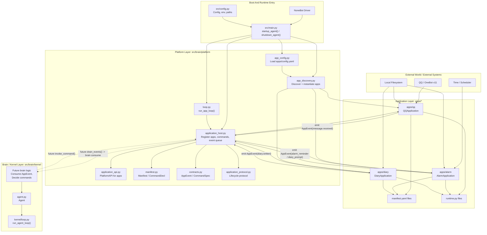
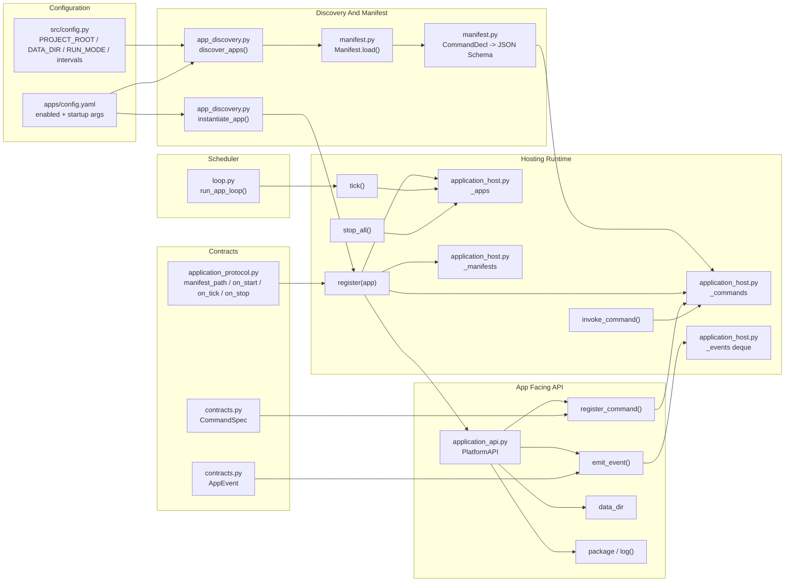
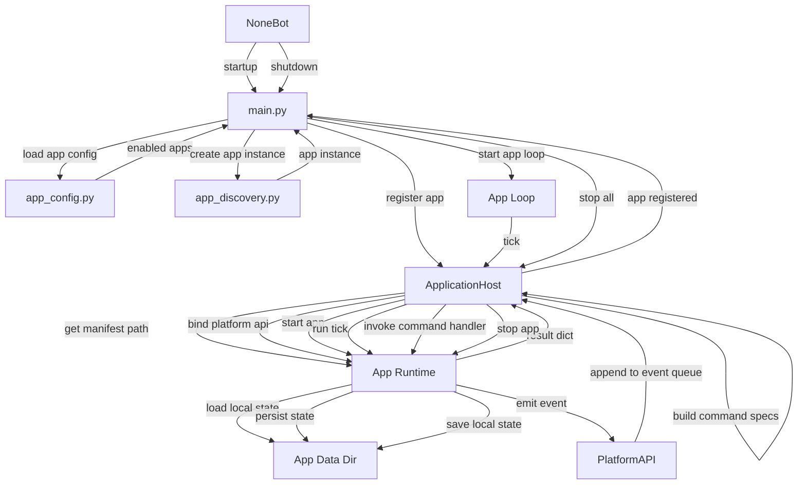
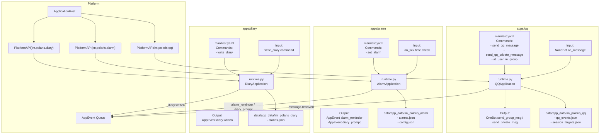

# Aurora-Bot

**图 1. 总体系统层级图**

**图 2. Platform 内部模块层级图**

**图 3. App 生命周期与运行时序图**

**图 4. App 族谱与职责边界图**

**现状解读**

- `platform` 的职责已经比较完整: 发现应用, 读取 manifest, 注册命令, 注入 `PlatformAPI`, 调度 `on_tick`, 管理事件队列. 这一套主要落在 [application_host.py](file:///e:/Coding%20Projects/Bot-Polaris/AuroraBot/src/brain/platform/application_host.py#L17-L115), [app_discovery.py](file:///e:/Coding%20Projects/Bot-Polaris/AuroraBot/src/brain/platform/app_discovery.py#L17-L128), [manifest.py](file:///e:/Coding%20Projects/Bot-Polaris/AuroraBot/src/brain/platform/manifest.py#L10-L106).
- `app` 的职责边界也很明确: 只做环境感知, 原子命令执行, 本地状态持久化, 向上抛 `AppEvent`. 这和 [APP_DEVELOPMENT_GUIDE.md](file:///e:/Coding%20Projects/Bot-Polaris/AuroraBot/docs/APP_DEVELOPMENT_GUIDE.md#L5-L127) 完全一致.
- 当前实际启用的是 `diary` 和 `alarm`, `qq` 在 `apps/config.yaml` 里默认是关闭的, 依据 [config.yaml](file:///e:/Coding%20Projects/Bot-Polaris/AuroraBot/apps/config.yaml#L1-L10).
- `brain/kernel` 目前只有最小骨架, 还没有真正消费 `ApplicationHost.drain_events()` 并决策 `invoke_command()`, 所以如果你要画"完整闭环", 最严谨的表达就是"平台层已就绪, 核心认知闭环预留中", 依据 [main.py](file:///e:/Coding%20Projects/Bot-Polaris/AuroraBot/src/main.py#L37-L48), [kernel/loop.py](file:///e:/Coding%20Projects/Bot-Polaris/AuroraBot/src/brain/kernel/loop.py#L11-L24).

**建议**

- 如果你要放进文档首页, 建议用 "图 1 + 图 4", 最容易让人一眼看懂.
- 如果你要给开发者讲框架实现, 建议用 "图 2 + 图 3", 更适合说明注册流程和运行机制.
- 如果你愿意, 我下一步可以直接把这 4 张图整理成一个 `docs/platform_app_architecture.md` 文件, 并顺手补一版"现状图"和"目标图"双版本文档.
