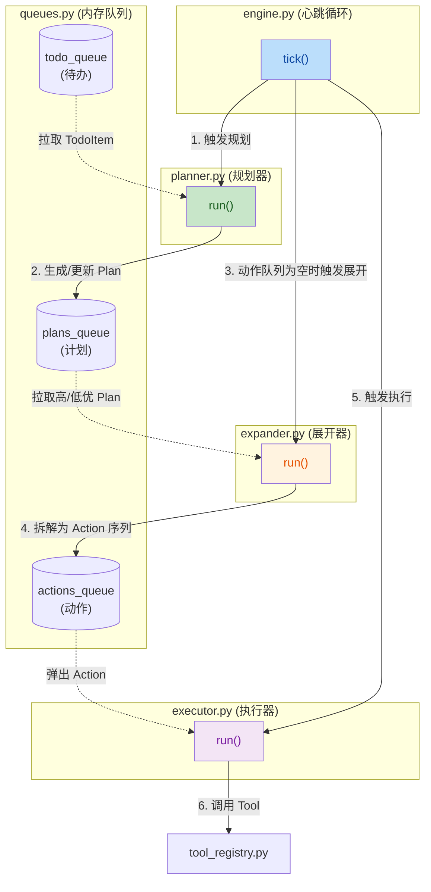

## 1. High-Level Summary (TL;DR)

- **Impact:** High (高) - 本次提交属于核心架构级的重构，引入了全新的 Plan-Attention-Action (PAA) 引擎，替换了原有的简单任务执行逻辑。
- **Key Changes:**
  - ✨ **新增 PAA 引擎机制**：通过 `Engine` (心跳)、`Planner` (计划)、`Expander` (展开)、`Executor` (执行) 实现了完整的任务流转体系。
  - 🧠 **引入动态状态管理**：新增 `BotState`，支持动态管理机器人的“精力值 (Energy)”、“认知负载 (Cognitive Load)”以及“规划间隔”。
  - 🗂️ **多级任务队列**：引入 `TodoQueue`、`PlansQueue`、`ActionsQueue`，实现从待办事项到具体执行动作的分层管理。
  - ⚙️ **重构启动与配置模块**：`main.py` 支持按 `RUN_MODE` (core/prod/test) 动态加载服务；大幅扩充了与引擎相关的运行配置参数。

---

## 2. Visual Overview (Code & Logic Map)

以下图表展示了全新的 PAA 引擎 (Plan-Attention-Action) 在每个心跳周期 (Tick) 内的数据流向与业务逻辑交互：

---

## 3. Detailed Change Analysis

### 🎯 核心组件: PAA 引擎 (`src/brain/core/`)

- **`agent.py` & `engine.py`**:
  - **What Changed**: 引入了 `Agent` 类管理引擎的启停，并内置了多个基础 Demo Tools（如 `recall_memory`, `generate_response`）。`engine.py` 维护了一个定时心跳循环 `run_loop`，每隔一定时间调用 `tick()` 更新机器人状态，并依次调度 Planner、Expander 和 Executor。
- **`planner.py`**:
  - **What Changed**: 将零散的 `TodoItem` 聚合为 `Plan`。通过分析任务的意图 (`intent`) 和紧急程度 (`urgency`) 计算基础优先级并存入计划队列。_(Source: `planner.py`)_
- **`expander.py`**:
  - **What Changed**: 将抽象的 `Plan` 展开为具体的 `Action` 列表。例如，将 `handle_qq_messages` 计划拆解为读取记忆、生成回复、更新记忆等多个步骤，并计算该注意力 (Attention) 预估的精力消耗。
- **`executor.py`**:
  - **What Changed**: 消费动作队列。在执行具体动作前会检查 `BotState` 的精力值是否足够 (`has_energy`)。如果精力不足，则会将当前的 Attention 状态置为 `PAUSED`，等待精力恢复。

### 📊 数据结构: 意图与动作映射 (Intent to Actions)

根据 `expander.py` 的逻辑，核心意图的拆解关系如下：

| Intent (意图)          | Expanded Actions (拆解动作)                                                         | Energy Cost (总耗能估算) |
| ---------------------- | ----------------------------------------------------------------------------------- | ------------------------ |
| **handle_qq_messages** | `recall_memory` -> `generate_response` -> `send_console_message` -> `update_memory` | 13.0                     |
| **handle_alarm**       | `evaluate_ignore` -> `alert_user` -> `finalize_alarm`                               | 4.0                      |
| **self_maintenance**   | `run_self_maintenance`                                                              | 3.0                      |

### ⚙️ 配置与启动重构 (`config.py` & `main.py`)

- **What Changed**:
  - `main.py` 不再硬编码启动 QQ 和 Alarm 服务，而是根据 `RUN_MODE` 的值动态加载。
  - `config.py` 支持按层级加载环境变量 (`.env`, `.env.dev`, `.env.prod`)，并增加了大量引擎调度参数。
  - `Logger.py` 默认日志文件名由 `polaris.log` 变更为 `aurora.log`。

| Config Key              | 默认值 | 描述                            |
| ----------------------- | ------ | ------------------------------- |
| `RUN_MODE`              | "core" | 运行模式，支持 core, prod, test |
| `HEARTBEAT_INTERVAL`    | 1.0    | 引擎心跳间隔（秒）              |
| `ENERGY_MAX`            | 24.0   | 机器人最大精力值上限            |
| `ENERGY_REGEN_PER_BEAT` | 4.0    | 每个心跳周期恢复的精力值        |
| `MAX_ACTIONS_PER_BEAT`  | 4      | 每个心跳最多执行的 Action 数量  |
| `BUSY_THRESHOLD`        | 0.6    | 触发“忙碌”状态的认知负载阈值    |

---

## 4. Impact & Risk Assessment

- ⚠️ **Breaking Changes (破坏性更新)**:
  - 启动入口 `main.py` 的行为发生重大改变。如果不配置正确的 `RUN_MODE=prod` 且未开启对应开关（如 `ENABLE_QQ_SERVICE=1`），外部服务将不会启动，机器人将仅以空转 `core` 模式运行。
- 🐛 **潜在风险 (Risks)**:
  - **精力枯竭死锁**：如果动作的 `energy_cost` 设定不合理，大于 `ENERGY_MAX`，或者堆积速度远超 `ENERGY_REGEN_PER_BEAT`，可能会导致执行器长期处于 `PAUSED` 状态。
  - **异常静默吞没**：在 `engine.py` 的 `tick()` 循环中，异常被直接 catch 并打印 log，可能导致某些严重错误无法引起进程级崩溃，增加排查难度。
- 🧪 **Testing Suggestions (测试建议)**:
  - 验证 `core` 模式下 `BOOTSTRAP_DEMO_TODOS=True` 的初始流转，观察 `aurora.log` 中 `Tick` 打印的 `energy` 和 `load` 变化。
  - 构造高频的 QQ 消息轰炸，测试 `BotState.cognitive_load` 的阈值计算是否准确，以及 `plan_interval` 是否能自适应调节。
