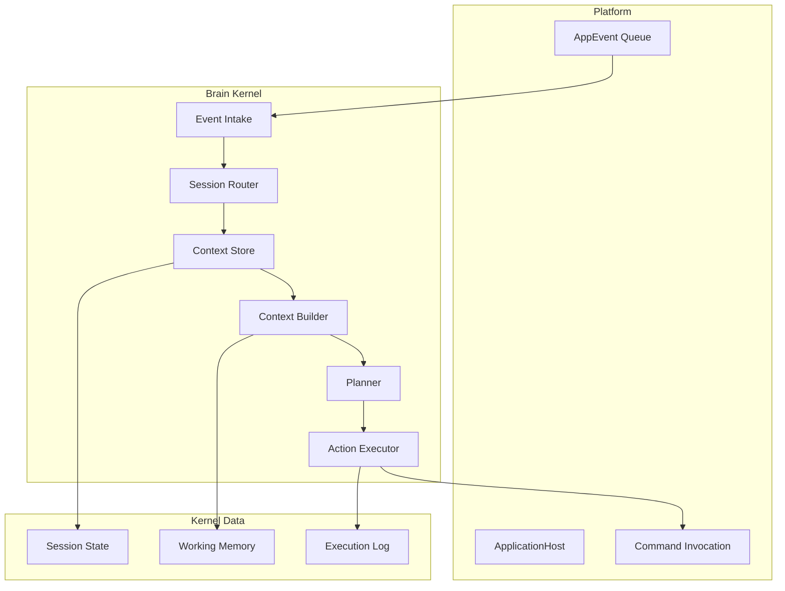
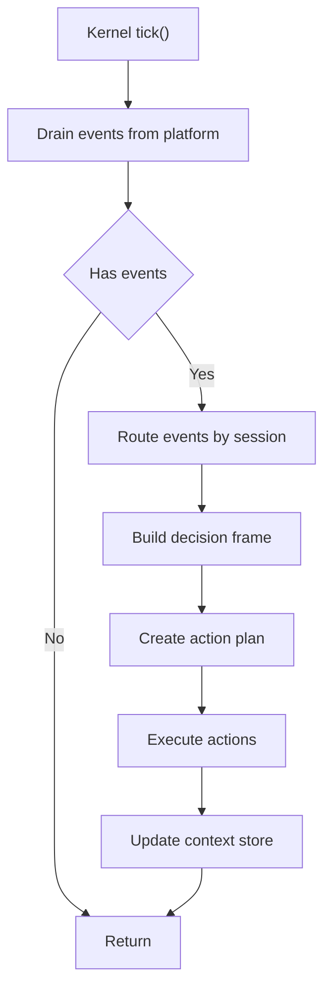

# AuroraBot Brain / Kernel 模块设计草案

## 1. 文档目标

本文档基于 `docs/PLATFORM_APP_ARCHITECTURE.md` 继续细化 `brain/kernel` 的设计草案.

重点回答 5 个问题:

- `brain/kernel` 在整个系统里到底负责什么.
- 它应该如何与 `platform` 对接.
- 它内部需要拆成哪些模块.
- 事件如何进入 Kernel, 命令如何从 Kernel 发回 App.
- 这个设计如何分阶段落地, 而不是一次性推翻现有代码.

本文档是架构草案, 目标是帮助后续实现时减少摇摆, 不要求现在就把所有模块一次写完.

## 2. 先给结论

如果只保留一句话, 我建议把 `brain/kernel` 定义为:

`brain/kernel` 是一个持续消费 `AppEvent`, 维护会话上下文, 生成动作计划, 并通过平台命令接口驱动 App 执行的决策内核.

再拆开一点看:

- `platform` 负责让 App 跑起来.
- `app` 负责感知外界和执行外部动作.
- `kernel` 负责把"发生了什么"转成"接下来该做什么".

因此, Kernel 的核心责任不是持有所有业务细节, 而是把事件处理链路做稳定, 可解释, 可扩展.

## 3. 设计边界

### 3.1 Kernel 负责什么

Kernel 应负责以下事项:

1. 从平台持续拉取标准化事件.
2. 根据事件类型和 `session_id` 做会话归属与路由.
3. 读取和维护当前会话的上下文状态.
4. 将事件整理为可供规划器理解的输入.
5. 产出一组明确的动作意图或命令调用计划.
6. 通过平台命令接口执行动作.
7. 记录执行结果, 并更新上下文和记忆状态.

### 3.2 Kernel 不负责什么

Kernel 不应负责以下事项:

- 不直接读写 App 私有 JSON 文件.
- 不直接调用 QQ SDK, 定时器, 文件系统适配器这类外部连接器.
- 不直接替代 `ApplicationHost` 的应用生命周期管理.
- 不让规划模块知道某个 App 的内部实现细节.
- 不把开发期 CLI 和运行时内核混在一起.

### 3.3 与 Platform 的边界

Kernel 和 Platform 的最小稳定边界建议只有两条:

1. 输入边界
   Kernel 只从 Platform 获取 `AppEvent`.

2. 输出边界
   Kernel 只通过 Platform 执行 `invoke_command()`.

也就是说, Platform 对 Kernel 暴露的最小接口应该类似:

```python
class KernelPlatformPort(Protocol):
    def drain_events(self, limit: int | None = None) -> list[AppEvent]: ...
    async def invoke_command(self, command_name: str, **kwargs: Any) -> Any: ...
    def list_commands(self) -> list[str]: ...
```

这能保证:

- Platform 可以继续自由演进内部实现.
- Kernel 不会和某个 App 的内部结构直接耦合.
- 独立测试时可以很容易 mock 这一层.

## 4. 当前现状与缺口

当前 `src/brain/kernel` 实际上只有两个骨架:

- `agent.py`
- `loop.py`

目前能够确认的现状是:

- `run_agent_loop()` 已经存在, 说明"心跳驱动的内核循环"这一层方向是对的.
- `ApplicationHost` 已经具备 `drain_events()` 和 `invoke_command()`, 说明平台对内核的输入输出接口已经有基础能力.
- 但 Kernel 本身还没有事件摄取, 路由, 上下文构建, 规划和动作执行这些中间层.

换句话说, 当前真正缺失的不是循环壳子, 而是循环里面的处理链.

## 5. 推荐的 Kernel 分层

建议把 `brain/kernel` 拆成 6 个逻辑层, 每层只做一类事.

### 5.1 Kernel 总体分层图



### 5.2 分层职责说明

#### A. Event Intake

职责:

- 从 Platform 拉取 `AppEvent`.
- 做最基础的输入校验和标准化.
- 处理批量拉取, 空批次, 过期事件, 重复事件等基础行为.

不负责:

- 不做复杂规划.
- 不做长上下文构建.
- 不直接执行业务动作.

#### B. Session Router

职责:

- 基于 `event.session_id`, `event.source`, `event.type` 把事件归入某个会话流或任务流.
- 支持默认路由规则和后续扩展规则.

这个模块的意义很大, 因为 Brain 的大多数思考其实都应该发生在"某个会话上下文"里, 而不是在全局事件池里.

#### C. Context Store

职责:

- 保存会话级运行状态.
- 保存最近事件窗口.
- 保存上次动作执行结果.
- 保存当前会话是否正在处理中.

这个模块可以先从内存版开始, 后续再落到持久化文件或数据库.

#### D. Context Builder

职责:

- 根据当前事件和会话状态构建本轮决策输入.
- 决定应该带入哪些近期事件, 哪些摘要, 哪些记忆片段.
- 输出一个对 Planner 友好的统一输入对象.

这层的价值是把"存了什么"和"本轮实际给模型看什么"分开.

#### E. Planner

职责:

- 根据当前上下文决定是忽略, 记录, 回复, 调用工具, 还是发起多步动作.
- 输出结构化计划, 而不是直接在这里做 I/O.

Planner 可以先从规则驱动开始, 再逐步接入模型推理.

#### F. Action Executor

职责:

- 将 Planner 产出的动作计划转成平台命令调用.
- 控制单轮最多执行多少个动作.
- 记录成功, 失败, 超时和异常.
- 将执行结果反馈回上下文状态.

这一层应该是 Kernel 唯一真正对外执行动作的地方.

## 6. 推荐模块列表

下面给出一版更贴近代码目录的建议拆分.

### 6.1 推荐目录结构

```text
src/brain/kernel/
  agent.py
  loop.py
  ports.py
  intake.py
  router.py
  context_store.py
  context_builder.py
  planner.py
  executor.py
  models.py
  policies.py
  runtime.py
```

### 6.2 各文件职责

#### `agent.py`

保留 `Agent` 这一抽象, 但应变成真正稳定的 Kernel 顶层协议, 不要只剩一个空的 `tick()`.

建议职责:

- 定义 `tick()` 抽象.
- 可选定义 `start()`, `stop()`, `health()` 等生命周期接口.

#### `ports.py`

定义 Kernel 对外依赖的抽象端口.

至少建议包含:

- `KernelPlatformPort`
- `MemoryPort`
- `ClockPort`
- `PlannerPort` 或 `LLMPort`

这样后续测试时可以完全脱离真实平台和真实模型.

#### `intake.py`

放事件摄取逻辑.

建议包含:

- 批量拉取事件
- 事件去重
- 基础过滤
- 事件预标准化

#### `router.py`

放事件到会话的路由规则.

建议支持:

- 基于 `session_id` 的默认路由
- 无 `session_id` 事件的兜底路由
- 系统级事件和用户级事件区分

#### `context_store.py`

放会话状态存储逻辑.

建议先做内存实现, 后续再做文件或数据库实现.

建议状态至少包括:

- `session_id`
- 最近事件列表
- 最近动作列表
- 上次处理时间
- 正在处理标记
- 摘要缓存

#### `context_builder.py`

放本轮输入构建逻辑.

这层输入建议包含:

- 当前事件
- 最近 N 条事件
- 最近 N 条动作结果
- 会话摘要
- 可用命令列表
- 必要的系统策略文本

#### `planner.py`

放"如何决策"这一层.

建议对外暴露统一接口:

```python
class Planner(Protocol):
    async def plan(self, frame: DecisionFrame) -> ActionPlan: ...
```

初版可以同时支持两种实现:

- `RulePlanner`
- `LLMPlanner`

#### `policies.py`

放规则策略和约束策略.

例如:

- 单轮最大动作数
- 某些事件类型是否允许直接回复
- 某些命令是否必须带特定参数
- 节流, 合并和冷却规则

#### `executor.py`

负责把 `ActionPlan` 真的落成命令执行.

建议职责:

- 逐条执行命令
- 收集结果
- 统一异常处理
- 返回结构化执行报告

#### `models.py`

放 Kernel 内部数据模型.

建议包括:

- `DecisionFrame`
- `SessionState`
- `PlannedAction`
- `ActionPlan`
- `ExecutionReport`

#### `runtime.py`

放真正的 `KernelAgent` 实现, 将上述模块串起来.

它应该是 `agent.py` 抽象的主实现.

## 7. 推荐数据模型

为了让 Kernel 可维护, 强烈建议先把内部数据模型定清楚.

### 7.1 事件输入模型

输入沿用平台层的 `AppEvent`, 不在 Kernel 里重新发明一套事件协议.

也就是说, Kernel 的入口对象仍然是:

- `source`
- `type`
- `session_id`
- `summary`
- `payload`
- `expire_at`
- `id`
- `created_at`

### 7.2 决策帧

建议定义一个 Kernel 内部对象 `DecisionFrame`, 表示"本轮真正要做决策的上下文".

建议字段:

```python
@dataclass(slots=True)
class DecisionFrame:
    session_id: str
    trigger_event: AppEvent
    recent_events: list[AppEvent]
    recent_actions: list[dict[str, Any]]
    session_summary: str
    available_commands: list[str]
    policy_hints: list[str]
```

这样做的意义是:

- Planner 不用直接碰 `ApplicationHost`.
- Planner 不用自己拼上下文.
- 后续无论接规则规划还是模型规划, 输入结构都稳定.

### 7.3 动作计划

建议 Planner 统一输出 `ActionPlan`.

```python
@dataclass(slots=True)
class PlannedAction:
    command_name: str
    arguments: dict[str, Any]
    reason: str = ""


@dataclass(slots=True)
class ActionPlan:
    session_id: str
    actions: list[PlannedAction]
    should_persist_summary: bool = False
    notes: str = ""
```

这个设计的关键点是:

- Planner 只负责"计划", 不直接负责"执行".
- Executor 只认 `ActionPlan`, 不理解上游的推理细节.

### 7.4 执行报告

执行层建议统一输出 `ExecutionReport`.

```python
@dataclass(slots=True)
class ActionResult:
    command_name: str
    success: bool
    result: Any = None
    error: str = ""


@dataclass(slots=True)
class ExecutionReport:
    session_id: str
    results: list[ActionResult]
    started_at: str
    finished_at: str
```

这样后续不管是更新上下文, 还是写日志, 还是喂回记忆系统, 都有稳定载体.

## 8. Kernel 主循环建议

### 8.1 推荐主循环

Kernel 的 `tick()` 建议遵循这个顺序:

1. 从 Platform 拉取一批事件.
2. 若无事件, 直接返回.
3. 将事件按会话或任务路由.
4. 对每个路由出的事件依次构建 `DecisionFrame`.
5. 交给 Planner 生成 `ActionPlan`.
6. 交给 Executor 执行计划.
7. 将结果写回 `ContextStore`.

### 8.2 主循环图



### 8.3 推荐伪代码

```python
class KernelAgent(Agent):
    async def tick(self) -> None:
        events = self._platform.drain_events(limit=self._max_batch_size)
        if not events:
            return

        routed = self._router.route(events)
        for routed_event in routed:
            frame = self._context_builder.build(
                routed_event=routed_event,
                store=self._context_store,
                commands=self._platform.list_commands(),
            )
            plan = await self._planner.plan(frame)
            report = await self._executor.execute(plan)
            self._context_store.apply(report)
```

## 9. Session 设计建议

### 9.1 为什么 Session Router 很关键

如果没有会话路由, Kernel 会很快遇到两个问题:

- 不同来源的事件会相互污染上下文.
- Planner 会在全局噪音里做错误判断.

所以 `session_id` 在这个系统里不是可有可无的字段, 而是 Kernel 的第一路由键.

### 9.2 推荐路由策略

建议初版采用简单稳定规则:

1. 若事件有 `session_id`, 直接归到对应 session.
2. 若没有 `session_id`, 则按 `source:type` 归入系统任务流.
3. 对纯系统类事件, 使用固定的 `system/<source>` 虚拟 session.

例如:

- QQ 私聊消息 -> `session_id = user_id`
- QQ 群消息 -> `session_id = group_id`
- 日记写入成功事件 -> 若无 session, 归入 `system/im.polaris.diary`
- 闹钟提醒事件 -> 优先使用 `payload.session_id`, 否则归入 `system/im.polaris.alarm`

## 10. Planner 设计建议

### 10.1 初版不要一开始就做成纯 LLM 黑盒

建议 Planner 从双层结构开始:

- 第一层: `Policy Gate`
- 第二层: `RulePlanner` 或 `LLMPlanner`

也就是:

1. 先由 `Policy Gate` 决定当前事件是否可忽略, 是否需要节流, 是否禁止某些动作.
2. 再由真正的 Planner 产出动作计划.

这样做的好处:

- 安全约束不完全依赖模型自觉.
- 很多显而易见的无效事件可以在进入模型前就被挡掉.
- 后续策略调优也更可控.

### 10.2 Planner 输出不要直接是自然语言

Planner 的输出应是结构化计划, 至少包含:

- 调哪个命令
- 传什么参数
- 为什么这样做

而不是单纯输出一段文本再由别的层去猜.

### 10.3 推荐 Planner 演进顺序

建议按照这个顺序演进:

1. `NoOpPlanner`
   用于把主链路跑通.
2. `RulePlanner`
   处理最简单的事件到命令映射.
3. `HybridPlanner`
   规则优先, 模型补充.
4. `LLMPlanner`
   用于更复杂的上下文理解和动作编排.

## 11. Executor 设计建议

### 11.1 为什么需要独立 Executor

很多系统喜欢让 Planner 直接调命令, 但这样会混掉两类职责:

- 决策
- 执行

独立 Executor 的好处是:

- 重试, 超时, 失败记录可以统一处理.
- Planner 可以保持纯逻辑层.
- 后续接审计, 回放, 幂等控制会更容易.

### 11.2 Executor 推荐行为

初版建议 Executor 具备以下行为:

- 严格按计划顺序执行.
- 单轮限制最大动作数.
- 单动作失败不一定中断整轮, 但要记录.
- 返回完整 `ExecutionReport`.

### 11.3 命令执行边界

Executor 只调平台端口:

```python
result = await platform.invoke_command(command_name, **arguments)
```

不要在 Executor 里直接 import 具体 App.

## 12. 记忆与上下文建议

### 12.1 建议先区分 3 类状态

初版至少区分:

1. 会话运行态
   短期, 高频更新, 例如最近消息和最近动作.

2. 会话摘要态
   低频更新, 用于压缩历史.

3. 长期记忆态
   低频读写, 用于跨会话和跨天信息保留.

### 12.2 初版落地建议

为了不把第一版做太重, 建议:

- `ContextStore` 先只做内存态 + 简单文件快照.
- 长期记忆接口先保留 Port, 不必一上来强绑某个实现.
- Planner 初版只吃最近窗口 + 会话摘要, 不必一次把记忆系统拉满.

## 13. 推荐接口草案

### 13.1 KernelPlatformPort

```python
from typing import Any, Protocol
from src.brain.platform.contracts import AppEvent


class KernelPlatformPort(Protocol):
    def drain_events(self, limit: int | None = None) -> list[AppEvent]: ...
    async def invoke_command(self, command_name: str, **kwargs: Any) -> Any: ...
    def list_commands(self) -> list[str]: ...
```

### 13.2 SessionRouter

```python
class SessionRouter(Protocol):
    def route(self, events: list[AppEvent]) -> list[AppEvent]: ...
```

如果后续要支持更复杂的批处理, 也可以把返回值升级成 `RoutedEvent`.

### 13.3 ContextStore

```python
class ContextStore(Protocol):
    def get_session(self, session_id: str) -> SessionState: ...
    def append_event(self, session_id: str, event: AppEvent) -> None: ...
    def apply_report(self, report: ExecutionReport) -> None: ...
```

### 13.4 Planner

```python
class Planner(Protocol):
    async def plan(self, frame: DecisionFrame) -> ActionPlan: ...
```

### 13.5 Executor

```python
class Executor(Protocol):
    async def execute(self, plan: ActionPlan) -> ExecutionReport: ...
```

## 14. 推荐落地阶段

### 第一阶段, 跑通最小主链

目标:

- 有一个真正可运行的 `KernelAgent`.
- 能从平台拉事件.
- 能构建最小 `DecisionFrame`.
- 能执行最简单命令计划.

最小产物:

- `ports.py`
- `models.py`
- `runtime.py`
- `planner.py` 里的 `NoOpPlanner` 或 `RulePlanner`
- `executor.py`

### 第二阶段, 会话化

目标:

- 让事件处理进入会话维度.
- 有独立 `SessionRouter`.
- 有最小 `ContextStore`.

最小产物:

- `router.py`
- `context_store.py`
- `context_builder.py`

### 第三阶段, 策略化

目标:

- 把安全约束和节流约束独立出来.
- 让 Planner 不直接承担全部规则.

最小产物:

- `policies.py`
- `PolicyGate`

### 第四阶段, 模型化

目标:

- 接入 LLM Planner.
- 摘要和长期记忆正式入链.

最小产物:

- `LLMPlanner`
- `MemoryPort`
- 摘要刷新和记忆读写逻辑

## 15. 对当前代码的直接建议

基于当前项目现状, 我建议下一步实现时优先做这些事:

1. 把 `ApplicationHost` 通过 Port 注入给 Kernel, 不要在 Kernel 中硬依赖具体 Host 类.
2. 实现一个最小 `KernelAgent`, 先只做:
   - 拉事件
   - 按 session 路由
   - 用规则生成命令
   - 执行命令
3. 让 `main.py` 在 `RUN_MODE in ["core", "prod"]` 时真正启动 `run_agent_loop()`.
4. 在 Kernel 初版中限制每轮事件批大小和每轮最大动作数, 避免失控.
5. 先让 `qq`, `alarm`, `diary` 这 3 个 App 跑通闭环, 再考虑复杂记忆系统.

## 16. 最终建议结论

如果要把这份草案压缩成一句实施建议, 我会这样说:

先实现一个"能消费 `AppEvent`, 能按 session 做决策, 能通过平台调用 App 命令"的最小 `KernelAgent`, 再逐步把上下文, 策略, 记忆和模型推理一层层补上.

这条路线的优点是:

- 最大化复用现有 `platform` 能力.
- 风险比全量重构小很多.
- 每一步都可以单独测试.
- 文档与代码的边界会保持一致.
