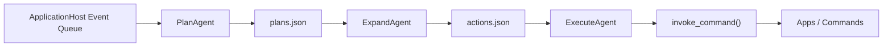

# AuroraBot 内核架构

## 文档目标

这份文档描述 AuroraBot 当前采用的内核设计，不再是早期的单体 `agent.tick()` 模型，而是一个由多个 stage agent 组成的内核流水线。

本文档重点说明：

- 内核与 `platform` / `apps` 的边界
- 当前三段式工作流如何运行
- `Agent` 基类的真实语义
- 持久化队列文件分别承担什么职责
- 后续如何扩展到 `memory`、`content_builder`、`llm` 等阶段

## 一句话概括

AuroraBot 的内核是一个官方维护的编排器：

- 由 `loop.py` 负责调度
- 由多个 stage agent 负责不同处理阶段
- 通过中间队列文件协作
- 只通过 `ApplicationHost` 读取事件和执行命令

## 总体边界

### Platform 负责什么

- 发现并加载应用
- 注册命令
- 维护事件队列
- 提供 `invoke_command()` 和 `peek/drain_events()` 能力

### App 负责什么

- 感知外部环境
- 执行原子动作
- 管理 app 私有数据
- 向宿主抛出标准化事件

### Kernel 负责什么

- 消费宿主事件
- 把事件转成可执行计划
- 把计划展开成动作
- 执行动作并回写状态

### Kernel 不负责什么

- 不直接读写 app 私有 JSON
- 不直接接 OneBot / QQ / 定时器 SDK
- 不绕过 `ApplicationHost` 直接调用应用

## 当前文件结构

```text
src/brain/
  agents/
    plan_agent.py
    expand_agent.py
    execute_agent.py
    test_agent.py
  kernel/
    agent_base.py
    agent_factory.py
    loop.py
    state_store.py
```

目录意图如下：

- `src/brain/kernel`
  - 放内核编排层
- `src/brain/agents`
  - 放内核内部子 agent

## 当前主链路

当前已落地的最小内核链路是：

```text
events -> plans -> actions -> execution
```

对应的三个 stage agent：

- `PlanAgent`
- `ExpandAgent`
- `ExecuteAgent`

### 流程图



## 调度模型

`src/brain/kernel/loop.py` 是内核编排入口。

它不是“某个 agent 的心跳包装器”，而是整个内核的调度器。

### 当前调度逻辑

每个心跳周期内：

1. 询问所有已装配 agent 是否要参与本轮工作
2. 收集它们的 `proposal`
3. 按优先级选择一个 agent
4. 只执行这个 agent 的一步工作
5. 重新评估下一步该轮到谁

这样做的好处：

- 避免一个 agent 长时间独占内核
- 允许阶段之间自然串联
- 便于后续增加更多 agent

### 当前默认装配顺序

当前内核默认装配：

- `plan`
- `expand`
- `execute`

但真正执行顺序不是硬编码串行，而是由各 agent 的 `proposal.priority` 决定。

## Agent 基类语义

`src/brain/kernel/agent_base.py` 定义了三个核心对象：

- `Agent`
- `AgentProposal`
- `AgentResult`

### `Agent` 的语义

这里的 `Agent` 不代表整个内核，而代表：

> 一个负责某个阶段处理的内部工作单元

也就是说：

- `PlanAgent` 负责“规划”
- `ExpandAgent` 负责“展开”
- `ExecuteAgent` 负责“执行”

而不是多个 agent 抢同一批事件各干各的。

### `propose()` 的语义

`propose()` 回答的问题是：

> 我负责的输入队列里，现在有没有值得我处理的工作？

它只做判断，不做实际副作用。

### `step()` 的语义

`step()` 回答的问题是：

> 如果本轮轮到我，我会处理一步什么工作？

它只执行一步，并返回结构化结果，不应该自己再发起一层内部调度。

### `AgentProposal`

当前结构：

```python
@dataclass(slots=True)
class AgentProposal:
    priority: int = 0
    reason: str = ""
    metadata: dict[str, Any] = field(default_factory=dict)
```

含义：

- `priority`
  - 该 agent 当前希望被调度的优先级
- `reason`
  - 本次提案的原因，主要用于日志和调试
- `metadata`
  - 附加上下文，例如待处理项数量、所属阶段

### `AgentResult`

当前结构：

```python
@dataclass(slots=True)
class AgentResult:
    handled: bool = False
    summary: str = ""
    events_consumed: int = 0
    commands_attempted: int = 0
    commands_succeeded: int = 0
    metadata: dict[str, Any] = field(default_factory=dict)
```

含义：

- `handled`
  - 本步是否真的处理了工作
- `summary`
  - 本步摘要
- `events_consumed`
  - 消费了多少输入事件
- `commands_attempted`
  - 尝试了多少命令
- `commands_succeeded`
  - 成功执行了多少命令

## 三个 stage agent 的职责

### 1. PlanAgent

输入：

- `ApplicationHost` 事件队列

输出：

- `data/kernel/plans.json`

职责：

- 从 `AppEvent` 中提取待处理事项
- 把事件转换为 plan 记录
- 为后续阶段提供稳定输入

当前设计原则：

- 只有 `PlanAgent` 直接消费宿主事件
- 其他阶段不直接碰事件队列

### 2. ExpandAgent

输入：

- `data/kernel/plans.json`

输出：

- `data/kernel/actions.json`

职责：

- 读取 `pending` 的 plan
- 选择合适的命令
- 根据命令 schema 生成最小 `kwargs`
- 产出待执行 action

当前是机械启发式实现：

- 优先匹配一些偏安全的命令名后缀
- 否则按事件类型和计划文本做简单匹配
- 最后回退到第一个可用命令

### 3. ExecuteAgent

输入：

- `data/kernel/actions.json`

输出：

- 真实命令调用
- `plan/action` 状态更新

职责：

- 读取待执行 action
- 调用 `ApplicationHost.invoke_command()`
- 记录成功与失败
- 回写 `plans.json` 和 `actions.json`

这是当前唯一真正对外执行副作用的阶段。

## 持久化队列

当前内核通过 `src/brain/kernel/state_store.py` 读写两个核心文件：

- `data/kernel/plans.json`
- `data/kernel/actions.json`

### `plans.json`

语义：

- 事件到计划的中间产物

当前字段大致包括：

- `id`
- `source_event_id`
- `source_event_type`
- `source`
- `session_id`
- `goal`
- `summary`
- `payload`
- `status`
- `priority`
- `created_at`
- `updated_at`

### `actions.json`

语义：

- 计划到执行动作的中间产物

当前字段大致包括：

- `id`
- `plan_id`
- `source_event_id`
- `command`
- `kwargs`
- `status`
- `created_at`
- `updated_at`
- `result` / `error`

## 运行时视角

### 内核与宿主的交互边界

当前内核只依赖宿主的三类能力：

- 看事件：`peek_events()`
- 取事件：`drain_events()`
- 调命令：`invoke_command()`

这意味着：

- `platform` 可以继续独立演进
- `kernel` 不需要知道某个 app 的内部细节
- 后续如果要 mock 内核，也比较容易抽成 port

### 当前调度优先级

当前三个阶段的大致优先级是：

- `ExecuteAgent`
- `ExpandAgent`
- `PlanAgent`

这意味着内核会优先：

1. 清理待执行动作
2. 再把 plan 展开成 action
3. 最后再继续吃新的 event

这种顺序适合避免中间队列积压太快。

## 为什么采用阶段式多 agent

AuroraBot 的目标不是“多个 agent 竞争同一批事件”，而是：

> 多个 agent 各自负责不同阶段，通过中间产物协作

这种设计有几个好处：

- 每个 agent 的职责非常单一
- 可以混合机械 agent 和 LLM agent
- 每一层都可以单独调试
- 中间状态可落盘，便于回放和排查

例如未来完全可以扩展为：

```text
events
  -> plan_agent
  -> content_builder_agent
  -> memory_agent
  -> expand_agent
  -> execute_agent
```

其中：

- `plan_agent` 可以是规则式
- `content_builder_agent` 可以是纯机械
- `memory_agent` 可以是抽取式
- `expand_agent` 可以是规则版或 LLM 版
- `execute_agent` 仍然保持机械执行

## 推荐扩展方向

当前三段式链路只是最小骨架。比较自然的下一步是：

### 第一批扩展

- 增加更明确的 `plan -> action` 规则
- 给 `plans.json` / `actions.json` 定更稳定的 schema
- 增加命令黑白名单和更严格的参数校验

### 第二批扩展

- 增加 `content_builder_agent`
- 引入会话级工作上下文
- 增加 action 失败重试与冷却策略

### 第三批扩展

- 增加 `memory_agent`
- 引入长期记忆读写
- 为 `expand_agent` 接入 LLM 或 hybrid planner

## 当前限制

当前实现仍然是内核最小骨架，存在这些已知限制：

- `ExpandAgent` 还不是严格 planner，只是启发式命令展开
- 队列状态目前用 JSON 文件持久化，适合调试，不适合高并发
- 还没有正式的 `session router`
- 还没有 `content_builder` 和 `memory` 阶段
- 还没有统一的策略门控层

## 结论

当前 AuroraBot 内核已经从“单个 agent 自己消费事件”的思路，转向了“官方内核编排多个阶段 agent”的方向。

最关键的架构原则是：

- `loop.py` 负责调度
- `Agent` 负责某个处理阶段
- agent 之间通过中间队列协作
- 只有边界阶段直接接触宿主 I/O

在这个基础上，后续继续加入 `memory`、`content_builder`、`llm planner` 都会比较顺。
