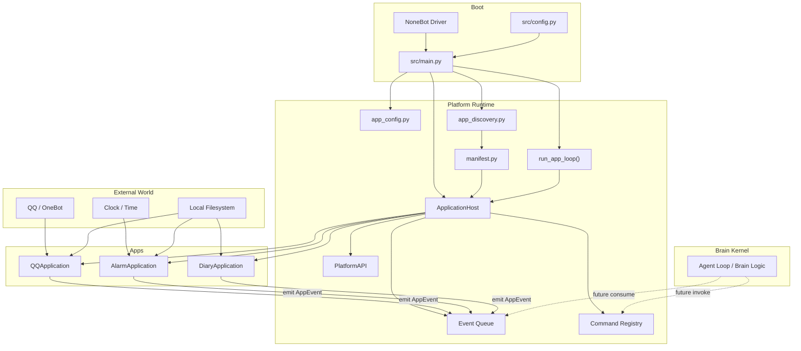
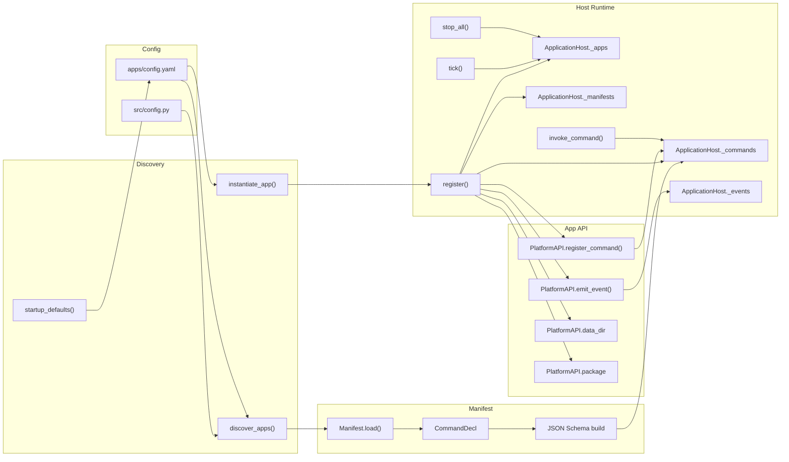
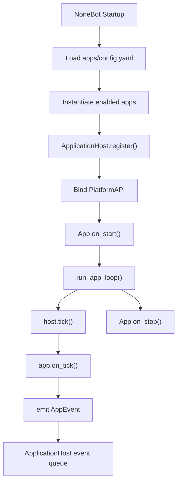
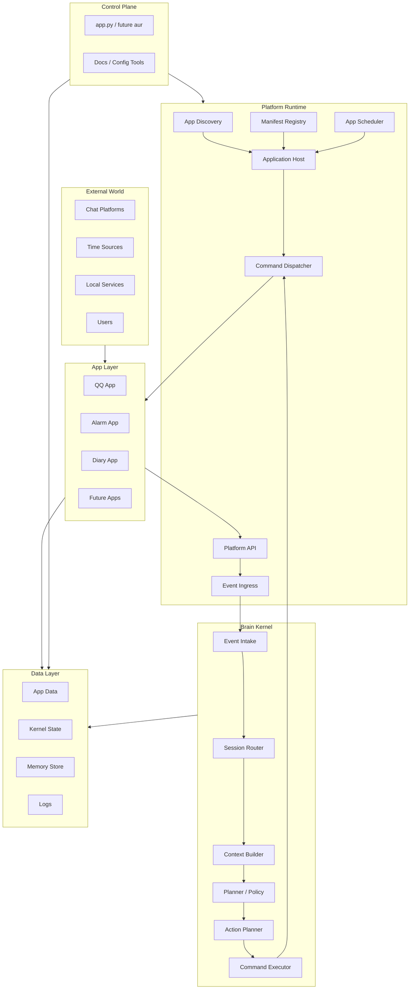
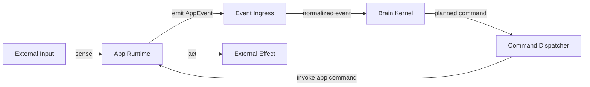
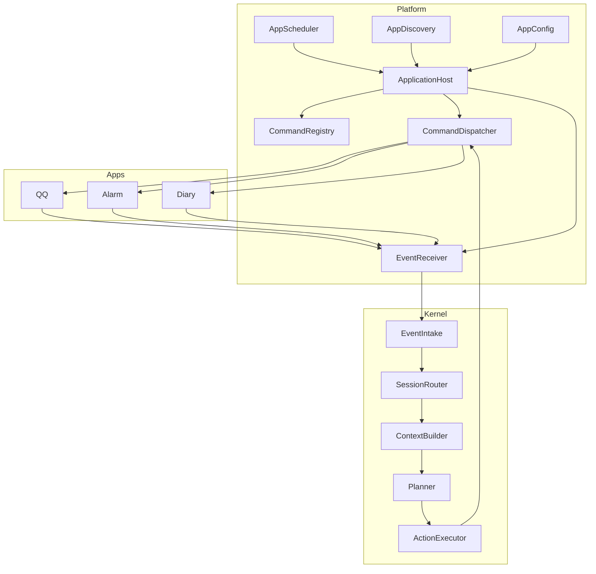

# AuroraBot Platform 与 App 架构梳理

## 1. 文档目的

本文档只讨论 `platform` 与 `app` 这一层的系统结构, 不展开具体模型提示词和业务细节.

目标有 4 个:

- 说明当前代码里已经存在的运行结构.
- 标出当前结构里的关键缺口和耦合点.
- 给出一版更清晰的目标架构图.
- 给后续 `brain/kernel` 接入提供统一语义边界.

本文档依据当前代码整理, 主要参考以下模块:

- `src/main.py`
- `src/config.py`
- `src/brain/platform/app_discovery.py`
- `src/brain/platform/app_config.py`
- `src/brain/platform/application_host.py`
- `src/brain/platform/application_api.py`
- `src/brain/platform/manifest.py`
- `src/brain/platform/contracts.py`
- `src/brain/platform/loop.py`
- `apps/qq/runtime.py`
- `apps/alarm/runtime.py`
- `apps/diary/runtime.py`
- `app.py`

## 2. 当前结论

先给结论, 便于快速建立全局认识.

- 当前 `platform` 层已经基本成型, 具备"发现应用, 读取 manifest, 实例化应用, 注入 API, 注册命令, 调度 tick, 缓存事件"这几项核心能力.
- 当前 `app` 层定位比较清晰, 主要承担"感知外界, 执行动作, 维护自身持久化状态, 向上抛出 `AppEvent`".
- 当前 `brain/kernel` 仍是骨架状态, 还没有正式接管 `ApplicationHost` 中的事件队列, 也没有形成完整的"事件 -> 决策 -> 命令调用"闭环.
- 因此, 现在的系统更接近"App Runtime Platform 已落地, Brain Control Loop 预留中"的状态.

## 3. 现状架构

### 3.1 现状总览

当前启动过程的关键路径是:

1. `src/main.py` 在 NoneBot 启动时执行 `startup_agent()`.
2. 通过 `app_config.py` 加载 `apps/config.yaml`.
3. 通过 `app_discovery.py` 动态实例化启用的应用.
4. `ApplicationHost.register()` 读取每个应用的 `manifest.yaml`, 自动注册命令, 注入 `PlatformAPI`, 并调用 `on_start()`.
5. `run_app_loop()` 周期性执行 `host.tick()`, 再由每个应用执行自己的 `on_tick()`.
6. 应用可以通过 `PlatformAPI.emit_event()` 把 `AppEvent` 放入 `ApplicationHost` 的事件队列.

需要特别注意的是:

- `ApplicationHost` 已经有 `drain_events()` 和 `invoke_command()`.
- 但 `main.py` 当前只真正启动了 `app loop`, 没有真正启动消费这些事件的 `agent loop`.
- 所以事件队列现在已经存在, 但还没有被核心智能体持续消费.

### 3.2 现状图, 总体层级

### 3.3 现状图, Platform 内部结构

这张图只看 `platform` 内部职责分工.

### 3.4 现状图, App 运行闭环

当前应用层已经具备稳定的运行闭环, 但这个闭环主要停留在"应用 runtime"内部.

### 3.5 现有 App 的职责边界

当前 3 个应用的边界已经很典型:

| App     | 输入来源              | 对外命令                      | 产生事件                         | 持久化                                   |
| ------- | --------------------- | ----------------------------- | -------------------------------- | ---------------------------------------- |
| `qq`    | NoneBot `on_message`  | 发群消息, 发私聊, 群内 @ 用户 | `message.received`               | `qq_events.json`, `session_targets.json` |
| `alarm` | 时间轮询, `on_tick()` | `set_alarm`                   | `alarm_reminder`, `diary_prompt` | `alarms.json`, `config.json`             |
| `diary` | 命令调用              | `write_diary`                 | `diary.written`                  | `diaries.json`                           |

可以看到, 这些 App 都符合同一个模式:

- 输入来自外部世界, 或来自平台调度.
- 输出不是复杂业务判断, 而是命令执行和事件上报.
- 各自维护自己的本地状态, 平台不直接侵入其内部存储结构.

## 4. 现状问题

### 4.1 当前已经做对的部分

- App 与 Brain 的职责分层方向是正确的.
- `manifest.yaml` 已经承担了命令声明层的职责.
- `PlatformAPI` 已经形成了对 App 的统一注入点.
- `ApplicationHost` 已经同时具备"命令注册中心"和"事件缓存入口"两种平台能力.
- `app.py` 已经能作为独立测试入口, 用于注册应用, 发事件, 跑 tick, 调命令.

### 4.2 当前最关键的缺口

最关键的缺口只有一个, 但它会影响整个闭环:

- 事件已经能进入 `ApplicationHost._events`.
- 命令已经能通过 `ApplicationHost.invoke_command()` 执行.
- 但是中间缺少一个正式的 `brain/kernel` 消费和调度层.

也就是说, 现在缺的是这条链路:

`AppEvent -> Brain Intake -> Context / Planning -> Command Invocation`

### 4.3 当前结构中的隐性风险

除了核心缺口, 还有几类后续很可能放大的风险:

1. `ApplicationHost` 目前既像宿主, 又像事件总线, 又像命令注册中心, 责任稍重.
2. 事件队列当前是内存 `deque`, 没有明确的消费语义, 也没有失败重试和事件确认语义.
3. Brain 接入后, 如果直接让 Brain 知道 App 过多内部细节, 容易把边界重新耦合回去.
4. `main.py` 当前同时承担启动配置, 注册应用, 调度 loop 等职责, 后续扩展时会变重.
5. App 事件目前是统一排队, 但还没有显式的会话路由, 优先级和去重语义.

## 5. 目标架构原则

目标架构不应该推翻现有设计, 而应该在现有 `platform` 之上补出一个清晰的 Brain 控制层.

建议遵守 6 条原则:

1. `platform` 只负责 runtime, 不负责认知决策.
2. `app` 只负责感知与执行, 不负责高阶规划.
3. `brain/kernel` 只消费标准化事件, 只调用标准化命令.
4. App 的状态归 App 自己管理, Brain 不直接读写 App 内部持久化文件.
5. 命令应该继续保持原子化, 可组合, 可测试.
6. 事件流和命令流要分开表达, 不要混成同一套抽象.

## 6. 目标架构

### 6.1 目标分层

建议把系统清晰拆成 5 层:

1. `Ingress / Egress Layer`
   App 连接外部世界, 如 QQ, 定时器, 本地文件.
2. `Platform Runtime Layer`
   负责发现 App, 宿主调度, 事件接入, 命令分发, App 生命周期管理.
3. `Brain Kernel Layer`
   负责事件消费, 上下文聚合, 计划生成, 动作选择, 命令调用.
4. `Data Layer`
   分开承载 App 自有数据, Kernel 上下文数据, 日志和记忆数据.
5. `Control Plane`
   负责开发期与运维期工具, 如 `app.py` 或未来的 `aur`.

### 6.2 目标图, 总体目标架构

### 6.3 目标图, 事件流与命令流分离

这个图专门表达一件事: 目标架构里, 事件流和命令流是两条不同链路.

这样做有几个直接好处:

- Brain 只理解事件和命令, 不依赖某个具体 App 的内部实现.
- Platform 可以替 Brain 保持命令分发和 App 生命周期管理.
- App 可以继续做独立测试, 不需要等 Brain 完整接入.

### 6.4 目标图, 推荐模块边界

这里最重要的不是文件名, 而是语义边界:

- `EventReceiver` 只管接收和标准化事件.
- `CommandRegistry` 只管记录有哪些命令可用.
- `CommandDispatcher` 只管把 Brain 的命令调用请求落到正确 App.
- `ApplicationHost` 只做宿主和聚合, 不再承载全部解释责任.

## 7. 建议的落地方式

### 7.1 第一阶段, 先把现状语义收紧

这一阶段不追求大改, 只做边界加固:

- 明确 `ApplicationHost` 是宿主, 不是 Brain.
- 明确 `AppEvent` 是 App 向上汇报的唯一标准事件.
- 明确 Brain 不直接操作 App 的本地 JSON 文件.
- 明确 `manifest.yaml` 只声明能力, 不承载复杂运行策略.

### 7.2 第二阶段, 接入真正的 Brain 消费链路

建议补出最小闭环:

1. Brain 从 `ApplicationHost.drain_events()` 持续拉取事件.
2. 根据 `session_id`, `type`, `payload` 做上下文聚合.
3. 生成一组待执行命令.
4. 通过 `ApplicationHost.invoke_command()` 执行命令.
5. 记录命令结果和失败信息.

只要这一步完成, 系统就从"应用运行平台"进入"具有认知闭环的代理系统".

### 7.3 第三阶段, 拆轻 `ApplicationHost`

当 Brain 接入后, 可以考虑把 `ApplicationHost` 中的职责拆薄:

- 事件缓存相关逻辑下沉到独立的 `EventReceiver` 或 `EventBus`.
- 命令注册和分发逻辑显式拆成 `CommandRegistry` 与 `CommandDispatcher`.
- `main.py` 只保留启动编排, 不承载过多运行细节.

## 8. 推荐的最终理解方式

如果用一句话描述这个系统, 我建议这样定义:

`platform` 是 App 的运行时宿主与标准化接口层, `app` 是外界的感知器和执行器, `brain/kernel` 是消费事件并编排命令的决策层.

再压缩一点, 就是:

- App 负责"看到"和"做到".
- Platform 负责"接起来"和"跑起来".
- Brain 负责"想明白再决定做什么".

## 9. 当前建议结论

对于当前项目, 最合理的方向不是推翻重写, 而是沿着现有结构继续演进:

- 保留 `apps/* + manifest.yaml + runtime.py` 这套应用模型.
- 保留 `ApplicationHost + PlatformAPI` 这套运行时骨架.
- 补出 Brain 对事件队列的正式消费层.
- 逐步把 `ApplicationHost` 从"全能入口"收敛成"宿主 + 聚合器".
- 把 `app.py` 或未来的 `aur` 作为控制平面, 不让它侵入 Brain 核心职责.

这样改, 风险最小, 并且能最大化复用当前已经写好的平台层代码.
