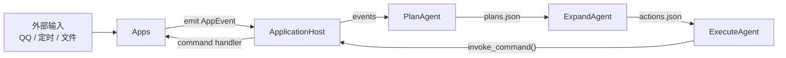

# AuroraBot 项目总览

AuroraBot 是一个基于 NoneBot 的本地智能体实验项目。

它把系统拆成两层：

- `platform`
  - 负责加载应用、注册命令、维护事件队列
- `kernel`
  - 负责消费事件、生成计划、展开动作、执行命令

当前项目已经从“单体 agent 直接处理事件”的模式，切换到了“多 stage agent 协作的内核流水线”。

## 当前架构一眼图



## 核心能力

- 应用宿主层：让 `apps/*` 以统一方式接入
- 内核编排层：把事件转成计划，再转成动作
- 本地持久化目录：便于观察和调试中间状态

## 建议阅读顺序

- [内核架构](./KERNEL_ARCHITECTURE_PLAN.html)
- [Platform 与 App 架构](./PLATFORM_APP_ARCHITECTURE.html)
- [App 开发者指南](./APP_DEVELOPMENT_GUIDE.html)
- [AUR CLI 规划](./AUR_CLI_PLAN.html)

## 启动方式

### 安装依赖

```bash
uv sync
```

### 启动项目

```bash
uv run .\bot.py
```

## 一句话总结

AuroraBot 当前的核心不是“一个会思考的大 agent”，而是一个由宿主层承接应用、由内核层编排多阶段 agent 的本地智能体运行时。
