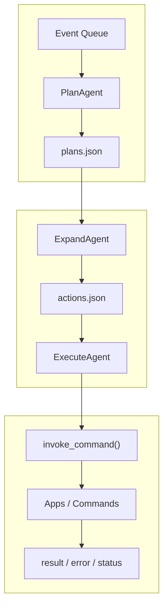

# 内核流水线

AuroraBot 没有把“大脑”塞进一个巨无霸 agent 里——她更喜欢分工合作。她的内核是一个由多个小 agent 组成的流水线，每个 agent 只干自己那一摊事儿。

**挼挼如是说**

> 你可以把内核想象成一个 mini 编辑部：PlanAgent 是选题策划，ExpandAgent 是撰稿人，ExecuteAgent 是执行编辑。稿子（计划）从策划流向撰稿，成文（动作）再交给执行编辑去发稿。没人一手包办，大家各司其职。

## 一句话概括

AuroraBot 的内核是一个编排器：

- `loop.py` 是那个敲钟的人，负责调度
- 多个 stage agent 各管一个环节
- 中间状态搁在队列文件里，谁也不抢谁的活
- 对外动手动脚的事，统一走 `ApplicationHost`

## 当前主链路

```text
events -> plans -> actions -> execution
```

三个核心工人：

| 工人            | 从哪拿料          | 往哪放           | 在干啥                       |
| --------------- | ----------------- | ---------------- | ---------------------------- |
| `PlanAgent`     | 宿主事件队列      | `plans.json`     | 把乱七八糟的事件理成待办计划 |
| `ExpandAgent`   | `plans.json`      | `actions.json`   | 把计划拆成具体可以执行的命令 |
| `ExecuteAgent`  | `actions.json`    | 命令调用结果     | 真动手干活，记下成与败       |

## 流程图



## 调度模型

`src/brain/kernel/loop.py` 是内核的心脏起搏器，每个周期它都干同一套活：

1. 挨个问所有 agent："有活干吗？"
2. 收集各自的 `proposal`
3. 按优先级挑一个幸运 agent
4. 让 ta 只干一步
5. 回到 1，下一轮重新评估

这么做的意思是：

- 没人能霸占内核一整轮
- 各阶段自然串起来了
- 将来想插个新 agent 也很方便

## Agent 基类语义

内核里的 `Agent` 不是“大脑”，它是一个工种。

### `propose()`

问的是：

> 我的输入筐里，现在有没有值得翻的牌？

只看不动手。

### `step()`

问的是：

> 好，轮到我了——这一步我该干啥？

只干一步，干完报告结果。

## 中间状态文件

### `plans.json`

语义是“事件 → 计划”的半成品。常见的字段：

- `id`
- `source_event_id`
- `source_event_type`
- `source`
- `session_id`
- `goal`
- `summary`
- `payload`
- `status`
- `priority`

### `actions.json`

语义是“计划 → 动作”的半成品。常见的字段：

- `id`
- `plan_id`
- `source_event_id`
- `command`
- `kwargs`
- `status`
- `result`
- `error`

## 当前三个工人的分工

### `PlanAgent` — 选题策划

- 直接看 `ApplicationHost` 的事件队列
- 把 `AppEvent` 提炼成稳定的计划记录
- 它是唯一直接接触宿主事件的人

### `ExpandAgent` — 撰稿人

- 翻出 `pending` 的计划
- 对照命令 schema 填好参数
- 目前主要还是靠启发式（经验法则），不是靠推理

### `ExecuteAgent` — 执行编辑

- 调 `ApplicationHost.invoke_command()` 真干活
- 记下谁成了、谁跪了
- 回写 `plan` 和 `action` 的状态
- 它是当前唯一对外产生真实副作用的人

## 当前的限制

- `ExpandAgent` 还不是一个正经的 planner，有点凭感觉
- 还没有统一的 session 路由，她有时候搞混谁是谁
- action 失败了没有重试和冷静期
- 队列还是用 JSON 文件存的——调试友好，生产还不够

## 自然的扩展方向

```text
events
  -> plan_agent
  -> content_builder_agent
  -> memory_agent
  -> expand_agent
  -> execute_agent
```

如果将来接上 LLM，最自然的落点是 `expand` 阶段或者新增一个 `planner` 阶段，而不是让执行阶段去兼做推理——那就乱套了。
