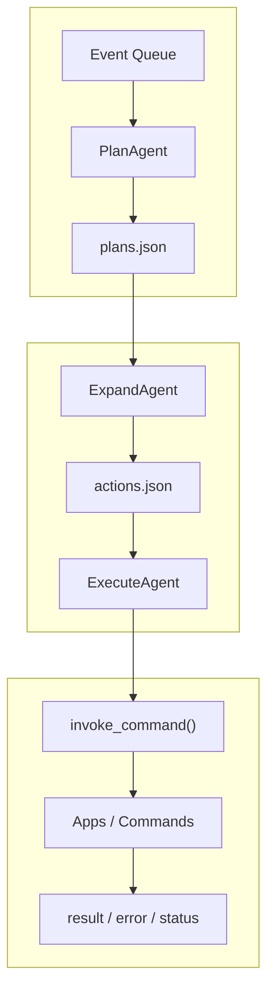

# 内核流水线

AuroraBot 当前采用的不是“单个 agent 直接处理全部事件”的模型，而是一个由多个 stage agent 组成的内核流水线。

## 一句话概括

AuroraBot 的内核是一个编排器：

- `loop.py` 负责调度
- 多个 stage agent 负责不同处理阶段
- 中间状态通过队列文件协作
- 对外副作用统一通过 `ApplicationHost` 执行

## 当前主链路

```text
events -> plans -> actions -> execution
```

对应三个核心阶段：

| 阶段           | 输入           | 输出           | 作用                     |
| -------------- | -------------- | -------------- | ------------------------ |
| `PlanAgent`    | 宿主事件队列   | `plans.json`   | 把事件整理成待处理计划   |
| `ExpandAgent`  | `plans.json`   | `actions.json` | 把计划展开成具体命令动作 |
| `ExecuteAgent` | `actions.json` | 命令调用结果   | 执行动作并回写状态       |

## 流程图



## 调度模型

`src/brain/kernel/loop.py` 是整个内核的调度入口。

每个心跳周期内，调度器会：

1. 询问所有已装配 agent 是否有工作可做
2. 收集各自的 `proposal`
3. 按优先级选择一个 agent
4. 只执行该 agent 的一步
5. 回到下一轮重新评估

这种做法的好处是：

- 避免单个阶段长期独占内核
- 阶段之间可以自然串联
- 后续更容易插入新的阶段

## Agent 基类语义

内核里的 `Agent` 不是“整套系统的大脑”，而是一个负责特定阶段的内部工作单元。

### `propose()`

回答的问题是：

> 我负责的输入队列里，现在有没有值得处理的工作？

它只负责判断，不做副作用。

### `step()`

回答的问题是：

> 如果这一轮轮到我，我会完成哪一步工作？

它只做一步处理，并返回结构化结果。

## 中间状态文件

### `plans.json`

语义是“事件到计划”的中间产物，常见字段包括：

- `id`
- `source_event_id`
- `source_event_type`
- `source`
- `session_id`
- `goal`
- `summary`
- `payload`
- `status`
- `priority`

### `actions.json`

语义是“计划到动作”的中间产物，常见字段包括：

- `id`
- `plan_id`
- `source_event_id`
- `command`
- `kwargs`
- `status`
- `result`
- `error`

## 当前实现特点

### `PlanAgent`

- 直接消费 `ApplicationHost` 的事件队列
- 把 `AppEvent` 提炼成稳定的计划记录
- 是唯一直接接触宿主事件的阶段

### `ExpandAgent`

- 读取 `pending` 计划
- 结合命令 schema 生成最小参数
- 当前仍然以启发式策略为主

### `ExecuteAgent`

- 调用 `ApplicationHost.invoke_command()`
- 记录成功与失败
- 回写 `plan` 与 `action` 的状态
- 是当前唯一真正对外产生副作用的阶段

## 当前限制

- `ExpandAgent` 还不是严格 planner
- 缺少统一的 session 路由
- 缺少 action 失败重试与冷却机制
- 仍然以 JSON 文件作为队列持久化

## 自然的扩展方向

```text
events
  -> plan_agent
  -> content_builder_agent
  -> memory_agent
  -> expand_agent
  -> execute_agent
```

如果后续接入 LLM，比较自然的落点通常会在 `expand` 或新的 `planner` 阶段，而不是直接让执行阶段承担推理职责。
