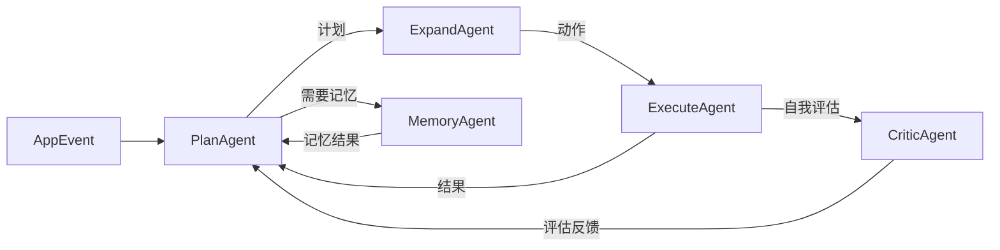

# 节点系统

Brain 层的认知能力由节点（Node）承载。每个节点是一个独立的认知工作单元，有明确的输入/输出契约，通过文件篮机制与上下游协同。节点的组合方式是有向有环图——不是流水线，而是网络。

## 节点的本质

**挼挼如是说**

> 一个节点就像编辑部里的一个编辑。他面前有一个"待办文件篮"（输入），背后有一个"已完成文件篮"（输出）。他不知道文件是谁放进来的，也不知道谁会拿走他的产出。他只做一件事：看到篮子里有新文件，就拿起来处理，处理完放回输出篮，然后等下一份。

## 节点的类型

### Agent 节点

执行认知任务的工作单元。Agent 节点是有状态的——它可能维护自己的内部上下文。

**核心接口：**

- `propose()` — 检查输入篮，判断是否有值得处理的内容。只读，不修改状态。
- `step()` — 从输入篮中取出一项，执行一步，将结果放入输出篮。

**设计约束：**

- 一步只做一件事——不垄断调度周期
- 输入和输出都通过文件篮，不直接调用其他节点
- 不感知上游是谁、下游是谁

### Router 节点

决定状态流转方向的决策单元。Router 节点不产生内容，只做路由。

**核心职责：**

- 检查输入篮中的内容
- 根据内容类型和当前系统状态，决定应送往哪个下游节点
- 在输出篮中标记目标节点

## 节点契约

每个节点声明自己的契约（Contract）：

```yaml
node:
  id: plan_agent
  type: agent
  contract:
    input:
      - type: AppEvent
        required: true
    output:
      - type: Plan
        required: true
  priority: 5
```

契约的作用：

- 内核调度器根据契约判断节点是否有匹配的输入
- 开发者在图中插入新节点时，需要对齐上下游的契约
- 未来脑区节点插件体系将使用契约做自动兼容性检查

## 有向有环图的图模型

节点之间通过有向边连接：



关键特征：

- **回环** — ExecuteAgent 的执行结果可以回到 PlanAgent，触发计划调整
- **分叉** — 一个节点的输出可以同时送往多个下游
- **可插拔** — MemoryAgent 和 CriticAgent 是规划中的节点，插入时不影响已有节点

## 文件篮的运行时行为

### 输入篮

- 每个节点有一个输入篮（逻辑上的队列）
- 上游节点的输出会被内核调度器传送到下游的输入篮
- 节点通过 `propose()` 检查输入篮，但不会"拿走"文件——只有 `step()` 才会消费

### 输出篮

- 每个节点有一个输出篮
- `step()` 完成后的产出放入输出篮
- 内核调度器负责将输出篮中的文件传送到正确的下游节点

### 文件生命周期

```
[上游输出篮] → 调度器 → [下游输入篮] → 节点 propose → 节点 step → [节点输出篮] → ...
```

每个文件在传递过程中携带元信息：来源节点、时间戳、优先级、锁状态。

## 锁机制

从 DeepSeek 评价中提炼出的设计（D老师如是说引用）：

每份文件上压着一个锁章，决定谁能读、谁能写：

| 锁状态 | 含义 |
|--------|------|
| `待读取` | 文件已到达输入篮，等待节点处理 |
| `追加中` | 节点正在向文件追加内容 |
| `已封存` | 文件处理完毕，不可修改，可被归档到记忆 |

锁机制确保：

- 同一时刻只有一个节点在写同一份文件
- 已完成的工作不会被意外覆盖
- 所有状态变更可追溯、可回放

## 节点与 LLM 网关

节点不直接调用 LLM。所有 LLM 调用通过 Brain 层的统一 LLM 网关：

- 网关管理模型切换、配额、重试
- 节点只提交 prompt 和上下文，网关返回结果
- 未来的节点插件也通过网关调用，不绕过管理层

## 当前状态

- Agent 节点（Plan / Expand / Execute）已可运行
- Router 节点（BroadcastRouter / HeartbeatRouter）部分实现
- 锁机制在设计阶段，当前用 JSON 文件属性模拟
- 节点插件体系尚未开放

## 下一步阅读

- 想理解脑区全貌：读 [脑区架构](./brain-architecture.html)
- 想理解调度怎么跑：读 [内核运行时](./kernel-runtime.html)
- 想开发节点插件：读 [脑区节点开发](../develop/brain-node-development.html)
