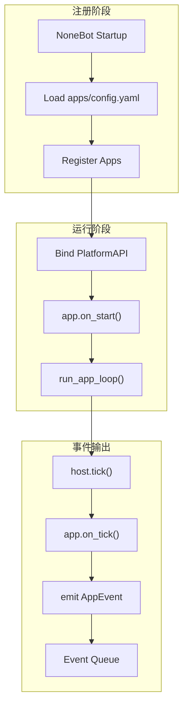

# 平台运行时

这一页只关注 `platform` 与 `app` 这一层，不展开内核提示词或模型策略。

## 平台层已经负责什么

当前 `platform` 层已经具备这些基础能力：

- 发现并实例化启用的应用
- 读取 `manifest.yaml`
- 注入 `PlatformAPI`
- 注册命令并维护命令表
- 维护事件队列
- 调度应用生命周期

## 当前启动链路

## 核心对象

### `ApplicationHost`

`ApplicationHost` 是宿主入口，当前承担了三类职责：

- 持有应用实例
- 持有命令注册表
- 持有事件队列

它已经提供几类关键能力：

- `register()`
- `tick()`
- `stop_all()`
- `drain_events()`
- `invoke_command()`

### `PlatformAPI`

`PlatformAPI` 是平台注入给 App 的统一交互面。

常用能力包括：

- `emit_event()`
- `register_command()`
- `data_dir`
- `package`
- `log()`

## App 在这个模型里的职责

每个 App 的定位都应尽量保持一致：

- 从外界接收输入
- 向上抛出标准化事件
- 暴露原子化命令
- 管理自己的本地数据

这意味着 App 更像“传感器 + 执行器”，而不是自己做完整决策。

## 当前典型应用边界

| App     | 输入来源              | 对外命令                      | 产生事件                         | 持久化                       |
| ------- | --------------------- | ----------------------------- | -------------------------------- | ---------------------------- |
| `qq`    | NoneBot `on_message`  | 发群消息、发私聊、群内 @ 用户 | `message.received`               | `qq_events.json` 等          |
| `alarm` | 时间轮询、`on_tick()` | `set_alarm`                   | `alarm_reminder`、`diary_prompt` | `alarms.json`、`config.json` |
| `diary` | 命令调用              | `write_diary`                 | `diary.written`                  | `diaries.json`               |

## 这一层现在还缺什么

- 事件虽然已经能进队列，但还缺稳定的消费链路衔接
- `ApplicationHost` 责任偏重，未来更适合继续拆薄
- 事件队列当前还是内存语义为主，缺少更完整的确认与重试设计

## 推荐的理解方式

如果只用一句话来记：

> `platform` 负责把 App 接起来并跑起来，`app` 负责看到和做到。

## 和内核的边界

为了避免重新耦合，推荐始终坚持：

- `platform` 不承担认知决策
- `kernel` 不直接读写 app 私有文件
- 内核只通过事件和命令这两条标准接口与平台交互

## 下一步阅读

- 想看整体边界：读 [系统架构总览](./system-overview.html)
- 想看内核如何消费事件：读 [内核流水线](./kernel-pipeline.html)
- 想写自己的应用：读 [App 开发指南](../guide/app-development.html)
