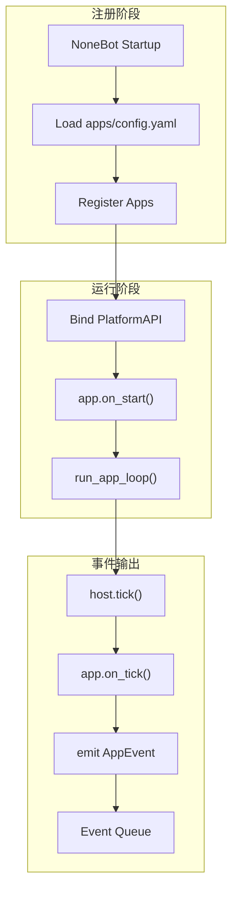

# 平台运行时

这一页只看 `platform` 和 `app` 这一层——不聊内核内部那些弯弯绕绕。

**挼挼如是说**

> 打个比方：platform 是插座，app 是电器。插座不关心你插的是电饭煲还是手机充电器，它只负责通电。app 也不关心电是怎么发的，它只负责干自己的活。

## 平台层已经能干什么

当前 `platform` 已经干了这几件事：

- 找到启用的应用，把它们 new 出来
- 读 `manifest.yaml`，搞清楚每个 app 能干什么
- 给每个 app 塞一根 `PlatformAPI` 的管子
- 把命令记在表上、把事件排进队列
- 管 app 的 startup → tick → stop 这一生

## 当前启动链路

## 核心对象

### `ApplicationHost` — 宿主管家

`ApplicationHost` 是 app 们的房东，目前身兼数职：

- 管着所有 app 实例
- 管着命令注册表
- 管着事件队列

已经提供的接口：

- `register()` — 让 app 住进来
- `tick()` — 敲一次门，让大家干活
- `stop_all()` — 轰所有人走
- `drain_events()` — 把积压事件倒出来
- `invoke_command()` — 让某个 app 干一件事

### `PlatformAPI` — 管子

这是平台塞给每个 app 的万能插座。app 通过它跟外界打交道：

- `emit_event()` — 喊一嗓子："出事了！"
- `register_command()` — "我会干这个"
- `data_dir` — 我的小仓库
- `package` — 我是谁
- `log()` — 记个日志

## App 在这模型里的定位

每个 App 最好都记住自己是干什么的：

- 从外面接收输入
- 把输入变成标准化事件扔出去
- 暴露干脆利落的命令
- 管好自己的小仓库

也就是说，App 更像 **传感器 + 遥控器**，而不是自己拍板做决策的那位。

## 当前几个 App 的分工

| App     | 靠什么知道外面的事     | 能干什么                       | 会喊什么                           | 自己存什么                  |
| ------- | ---------------------- | ------------------------------ | ---------------------------------- | --------------------------- |
| `qq`    | NoneBot `on_message`   | 发群消息、发私聊、群内 @ 人    | `message.received`                 | `qq_events.json` 之类       |
| `alarm` | 时间轮询、`on_tick()`  | `set_alarm` 设闹钟             | `alarm_reminder`、`diary_prompt`   | `alarms.json`、`config.json`|
| `diary` | 被命令叫醒             | `write_diary` 写日记           | `diary.written`                    | `diaries.json`              |

## 这层现在还没长好的地方

- 事件能进队列了，但从队列到被消费这截路还不太顺
- `ApplicationHost` 身上挂的事太多了，以后最好拆薄一点
- 事件队列目前还是"记在脑子里"，缺正式的确认和重试机制

## 一句话记住

> `platform` 负责把 App 们接好电跑起来，`app` 负责看到这个世界、做到该做的事。

## 和 Kernel、Brain 的边界

为了不搞成一锅粥，坚持这几条：

- `platform` 不替 brain 做认知决策
- `kernel` 不翻 app 的私房文件
- `brain` 通过 kernel 获取事件、通过 platform 分发命令
- Platform ↔ Kernel ↔ Brain 之间只通过 **事件** 和 **命令** 这两条管道说话

## 下一步阅读

- 想看整体边界：读 [系统架构总览](./system-overview.html)
- 想看内核怎么调度：读 [内核运行时](./kernel-runtime.html)
- 想看脑区怎么认知：读 [脑区架构](./brain-architecture.html)
- 想写自己的应用：读 [App 开发指南](../develop/app-development.html)
