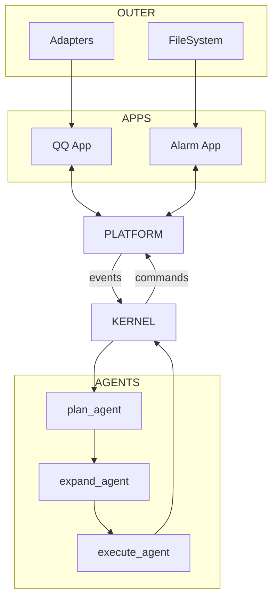

# 系统架构总览

AuroraBot 当前最重要的不是某个单独的 agent，而是三层职责边界是否清晰：

- `apps` 负责感知与执行
- `platform` 负责宿主与调度
- `kernel` 负责事件消费与动作编排

## 当前结论

- `platform` 已经基本成型，具备应用发现、manifest 解析、命令注册、事件缓存与生命周期调度
- `app` 层定位清晰，承担外部输入接入、原子动作执行与私有状态维护
- `kernel` 已经有最小闭环，但仍在骨架阶段
- 整个系统更接近“可扩展运行时”，而不是“完成态产品”

## 总体链路

## 三层分别负责什么

### App 层

App 是“环境的感知器与执行器”。

- 接入外部世界，如 QQ、定时器、文件系统
- 暴露命令，供内核在需要时调用
- 维护自己的持久化数据
- 把外部变化转换为标准化 `AppEvent`

### Platform 层

Platform 是“应用的运行时宿主”。

- 发现并实例化应用
- 解析 `manifest.yaml`
- 注入 `PlatformAPI`
- 维护命令注册表与事件队列
- 调用 `on_start()`、`on_tick()`、`on_stop()`

### Kernel 层

Kernel 是“多阶段决策编排器”。

- 消费宿主事件
- 把事件转换为计划
- 把计划展开为动作
- 调用平台命令分发能力执行动作

## 设计原则

1. `platform` 只负责把系统跑起来，不负责高阶决策
2. `app` 只负责感知和执行，不负责复杂规划
3. `kernel` 只理解标准事件与标准命令
4. App 私有数据归 App 自己管理
5. 事件流与命令流保持分离

## 当前缺口

最关键的缺口仍然是从事件到决策之间的中层能力还不够丰富：

- 会话路由还不完整
- 计划展开仍偏启发式
- 缺少统一的策略与安全门控
- 缺少长期记忆与内容构建阶段

## 下一步应该看什么

- 想看内核怎么一步步运行：读 [内核流水线](./kernel-pipeline.html)
- 想看宿主和应用的职责细节：读 [平台运行时](./platform-runtime.html)
