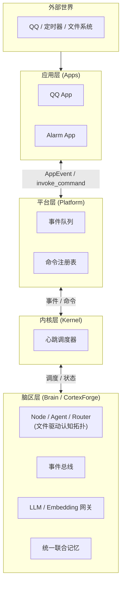

# 系统架构总览

AuroraBot 有四层身：

- **`apps`** — 她的感官和手脚，负责感知世界、执行动作
- **`platform`** — 她的身体，负责把器官都接好、让它们好好跑，与上下层双向通信
- **`kernel`** — 她的心跳，负责调度节奏、编排事件流与命令流
- **`brain`** — 她的大脑，代号 **CortexForge**——基于文件驱动、事件总线与声明式认知拓扑的智能体内核。内建 Node/Agent/Router 节点网络、LLM 网关与统一联合记忆

**挼挼如是说**

> 你别把 AuroraBot 想成一个"大模型套壳"，她更像一个分工明确的小社会：app 们是干活的工人，platform 是车间主任，kernel 是调度中心，brain 是研究院。研究院不自己去搬砖，工人也不替研究院做研究。

## 当前结论

如果非要给她现在的状态打个分——骨架已经站起来了，但肌肉还没长满：

- `platform` 已经基本成型，应用发现、manifest 解析、命令注册、事件缓存与生命周期调度都就位了
- `app` 层定位清晰，知道自己是"眼睛和手"，不是脑子
- `kernel` 已经跑通了最小闭环——从事件到调度到执行
- `brain` 层骨架已立，Agent 节点网络和 LLM 网关已可运转，有向有环图脑结构在持续演化
- 整个系统更像"可以继续长高的骨架"，而不是"开箱即用的完成品"

## 总体链路

## 四层分别负责什么

**挼挼如是说**

> 用一个不太恰当的比喻：app 是记者（在外面跑、采集信息），platform 是编辑部（安排版面、排期），kernel 是排班经理（决定今天谁干活、先干啥），brain 是主编团队（真正动脑子写稿子）。经理不写稿，记者也不排班。

### App 层 — 记者

App 是"环境的感知器与执行器"。

- 接入外部世界，如 QQ、定时器、文件系统
- 暴露命令，供上层在需要时调用
- 维护自己的持久化数据
- 把外部变化转换为标准化 `AppEvent`

### Platform 层 — 编辑部

Platform 是"应用的运行时宿主"。

- 发现并实例化应用
- 解析 `manifest.yaml`
- 注入 `PlatformAPI`
- 维护命令注册表与事件队列
- 负责与上下层（App ↔ Kernel）的双向通信
- 调用 `on_start()`、`on_tick()`、`on_stop()`

### Kernel 层 — 排班经理

Kernel 是"心跳调度器"。

- 消费宿主事件队列
- 按优先级调度 Brain 中的 Agent 节点
- 编排命令流，通过 Platform 分发执行
- 维护调度状态，不直接触碰 App 私事

### Brain 层 — 研究院

Brain 是"内建认知能力层"，代号 **CortexForge**——一个基于文件驱动、事件总线和声明式认知拓扑的智能体内核。

- 全部认知状态以文件形式持久化，具备元信息、版本与锁
- Node / Agent / Router 三类节点构成有向二分图（文件 ↔ 节点）
- 事件总线广播文件变更，节点按 glob 模式订阅并自行激活
- 统一 LLM 网关与 Embedding 网关
- 统一联合记忆（图式事实记忆 + 情景记忆 + 知识图谱经验记忆）
- 双上下文脑区：热认知池（人格主上下文）+ 冷认知池（结构化工单）
- 未来开放脑区节点插件，供第三方扩展认知能力

## 设计原则

1. `app` 只负责感知和执行，不替 brain 做认知
2. `platform` 只负责把系统跑起来和双向通信，不替 kernel 做调度决策
3. `kernel` 只负责调度与编排，不直接碰 app 的私事，不执行具体认知任务
4. `brain` 负责所有 LLM 推理、记忆存取与节点间认知流转
5. App 私有数据归 App 自己管
6. 事件流与命令流保持分离——各走各的道

## 当前她还没长好的地方

骨架有，但肌肉和神经还在长：

- 有向有环图的脑区节点编排还在从线性流水线向图结构过渡
- 会话路由还不完整，她有时候分不清谁在跟她说话
- 脑区节点插件体系尚未开放
- 缺一道统一的安全门禁
- 统一联合记忆的 mem0 整合在推进中

## 下一步看什么

- 想知道脑区节点怎么运转：读 [脑区架构](./brain-architecture.html)
- 想知道宿主和 app 怎么过日子：读 [平台运行时](./platform-runtime.html)
- 想知道内核怎么调度：读 [内核运行时](./kernel-runtime.html)
- 想知道记忆怎么设计：读 [统一联合记忆](./memory-system.html)
- 想知道她到底在想什么：读 [DeepSeek 说她是什么](../appendix/comment-of-deepseek.html)
