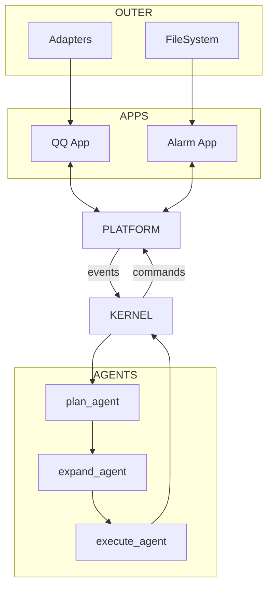

# 系统架构总览

AuroraBot 有三层身——说得中二一点，这算她的三重人格：

- **`apps`** — 她的感官和手脚，负责感知世界、执行动作
- **`platform`** — 她的身体，负责把器官都接好、让它们好好跑
- **`kernel`** — 她的大脑，负责看事情、想事情、安排事情

**挼挼如是说**

> 你别把 AuroraBot 想成一个"大模型套壳"，她更像一个分工明确的小社会：app 们是干活的工人，platform 是车间主任，kernel 是董事会。董事会不自己去搬砖，工人也不替董事会做决策。

## 当前结论

如果非要给她现在的状态打个分——骨架已经站起来了，但肌肉还没长满：

- `platform` 已经基本成型，应用发现、manifest 解析、命令注册、事件缓存与生命周期调度都就位了
- `app` 层定位清晰，知道自己是"眼睛和手"，不是脑子
- `kernel` 已经跑通了最小闭环——从事件到计划到执行，虽然还比较朴素
- 整个系统更像"可以继续长高的骨架"，而不是"开箱即用的完成品"

## 总体链路

## 三层分别负责什么

**挼挼如是说**

> 用一个不太恰当的比喻：app 是记者（在外面跑、采集信息），platform 是编辑部（安排版面、排期），kernel 是主编（决定今天报道什么方向）。主编不自己去采访，记者也不决定报纸头版。

### App 层 — 记者

App 是“环境的感知器与执行器”。

- 接入外部世界，如 QQ、定时器、文件系统
- 暴露命令，供内核在需要时调用
- 维护自己的持久化数据
- 把外部变化转换为标准化 `AppEvent`

### Platform 层 — 编辑部

Platform 是“应用的运行时宿主”。

- 发现并实例化应用
- 解析 `manifest.yaml`
- 注入 `PlatformAPI`
- 维护命令注册表与事件队列
- 调用 `on_start()`、`on_tick()`、`on_stop()`

### Kernel 层 — 主编

Kernel 是“多阶段决策编排器”。

- 消费宿主事件
- 把事件转换为计划
- 把计划展开为动作
- 调用平台命令分发能力执行动作

## 设计原则

1. `platform` 只负责把系统跑起来，不替 kernel 做决策
2. `app` 只负责感知和执行，不替 kernel 做规划
3. `kernel` 只理解标准事件与标准命令，不直接碰 app 的私事
4. App 私有数据归 App 自己管
5. 事件流与命令流保持分离——各走各的道

## 当前她还没长好的地方

骨架有，但肌肉和神经还在长——最明显的缺口集中在“看懂事件 → 做出决策”这条中间地带：

- 会话路由还不完整，她有时候分不清谁在跟她说话
- 计划展开还是“凭经验”，不是严格推理
- 缺一道统一的安全门禁
- 长期记忆和内容构建还没真正上线

## 下一步看什么

- 想知道内核每一步怎么走：读 [内核流水线](./kernel-pipeline.html)
- 想知道宿主和 app 怎么过日子：读 [平台运行时](./platform-runtime.html)
- 想知道她到底在想什么：读 [DeepSeek 说她是什么](../appendix/comment-of-deepseek.html)
