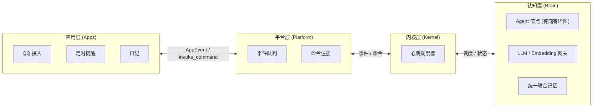

## 她是什么

AuroraBot 是新一代**内驱式、自主决策的智能体框架**。

她由四层协作者构成：

- **应用层（Apps）** — 可插拔的感知器与执行器，通过统一 PlatformAPI 接入外部世界
- **平台层（Platform）** — 统一管理应用的运行时宿主，负责与上下层双向通信
- **内核层（Kernel）** — 管理与调度核心，编排事件流与命令流
- **认知层（Brain）** — 文件驱动的认知操作系统内核。Node / Agent / Router 节点网络 + 事件总线 + 统一 LLM 网关 + 统一联合记忆

> 她不是在“等待指令”，而是在“持续观察、自主决策、主动行动”。

## 四层架构

### 高度解耦的 App 插件体系

每个 App 都是独立的感知器与执行器，通过统一的 `PlatformAPI` 与宿主交互。接入 QQ、定时器、文件系统、甚至外部 API——都只需要一个 App。

### 有向有环图的认知 Agent 网络

认知不依赖单一“超级 Agent”，而是由多个 Agent / Router 节点构成有向有环图。节点之间通过文件篮机制传递状态，形成持续运转的认知循环。未来开放认知节点插件，供第三方扩展认知能力。

### 统一联合记忆

AuroraBot 的记忆不只是“存下来”，而是**结构化地生长**。知识图谱、向量检索与情景记忆融合为一个统一记忆层，让每一次事件、每一次决策都参与记忆演化。

## 计划中的 MCP 适配容器

我们正在设计一个 **MCP (Model Context Protocol) 适配容器**，让任意 MCP 服务器以 App 形态接入 AuroraBot。

这意味着：

- 任何遵循 MCP 协议的工具都可以成为 AuroraBot 的能力延伸
- MCP 工具会被自动映射为内核可调用的命令
- 内核无需感知 MCP 协议细节，由适配容器统一处理

> 让 MCP 生态成为你的能力延伸。

## 快速导航

完整的架构设计、使用指南与开发文档请 **[访问 AuroraBot 文档站 📖](https://jufirex.github.io/AuroraBot/)**：

| 文档                                                                                  | 说明                                       |
| ------------------------------------------------------------------------------------- | ------------------------------------------ |
| [项目总览](https://jufirex.github.io/AuroraBot/start/overview.html)                   | 快速了解 AuroraBot 的定位与四层分层        |
| [快速开始](https://jufirex.github.io/AuroraBot/start/getting-started.html)            | 从零把项目跑起来                           |
| [系统架构总览](https://jufirex.github.io/AuroraBot/architecture/system-overview.html) | 理解 Apps / Platform / Kernel / Brain 四层 |
| [认知架构](https://jufirex.github.io/AuroraBot/architecture/brain-architecture.html)  | 深入有向有环图的 Agent 节点网络            |
| [平台运行时](https://jufirex.github.io/AuroraBot/architecture/platform-runtime.html)  | 理解宿主与 App 的运行时关系                |
| [App 开发指南](https://jufirex.github.io/AuroraBot/develop/app-development.html)      | 开发你自己的 App                           |
| [AUR CLI](https://jufirex.github.io/AuroraBot/develop/aur-cli.html)                   | 应用开发工具链                             |

## 开源致谢

AuroraBot 站在众多优秀开源项目的肩膀上构建：

| 项目                                              | 说明                     | 开源协议                                                                            |
| ------------------------------------------------- | ------------------------ | :---------------------------------------------------------------------------------- |
| [NoneBot2](https://github.com/nonebot/nonebot2)   | 跨平台 Python 机器人框架 | [MIT License](https://github.com/nonebot/nonebot2/blob/master/LICENSE)              |
| [LiteLLM](https://github.com/BerriAI/litellm)     | 统一 LLM API 调用层      | [LICENSE](https://github.com/BerriAI/litellm/blob/litellm_internal_staging/LICENSE) |
| [mem0](https://github.com/mem0ai/mem0)            | 智能体记忆基础设施       | [Apache License 2.0](https://github.com/mem0ai/mem0/blob/main/LICENSE)              |
| [ChromaDB](https://github.com/chroma-core/chroma) | 开源向量数据库           | [Apache License 2.0](https://github.com/chroma-core/chroma/blob/main/LICENSE)       |
| [OneBot](https://github.com/botuniverse/onebot)   | 统一聊天机器人接口标准   | [MIT License](https://github.com/botuniverse/onebot/blob/main/LICENSE)              |
| [VitePress](https://github.com/vuejs/vitepress)   | 文档站生成框架           | [MIT License](https://github.com/vuejs/vitepress/blob/main/LICENSE)                 |

特别感谢 **[MaiBot](https://github.com/MaiM-with-u/MaiBot)** 为本项目提供架构灵感与设计参考。
