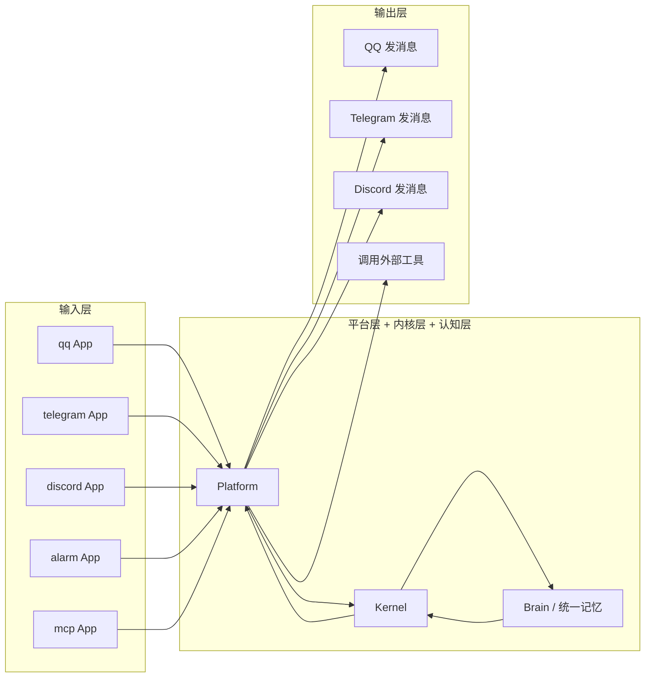

# 关于跨平台

## AuroraBot 支持哪些平台?

当前版本**仅支持 QQ 接入**, 通过 NapCat + `nonebot-adapter-onebot` 与 QQ 通信。

但 AuroraBot 的架构从设计之初就是平台无关的 -- `apps` 层是可插拔的感知器与执行器, 每个 App 通过统一的 `PlatformAPI` 与宿主交互。换平台只需换 App, 不需要动内核和认知。

---

## NapCat 的跨平台能力如何?

[NapCatQQ](https://github.com/NapNeko/NapCatQQ) 是一个基于 NTQQ 的现代化 Bot 协议端实现, 它对运行环境的支持非常全面:

| 部署方式       | 适用场景      | 说明                                                     |
| -------------- | ------------- | -------------------------------------------------------- |
| Windows 原生   | 桌面 / 笔记本 | 直接运行 exe, 支持 LiteLoader 插件方式                   |
| Linux AppImage | 物理机 / VPS  | 单文件运行, 无需安装依赖                                 |
| Linux 原生     | 物理机 / VPS  | 放入 QQ 安装目录运行                                     |
| Docker         | 服务器 (推荐) | 支持无头模式, 内存占用极低, 可在纯服务器环境无需桌面运行 |
| macOS          | Mac 用户      | 原生支持                                                 |
| Android Termux | 移动端        | 在安卓终端中运行                                         |

::: tip 无头模式
NapCat 的**无头模式** (`headless`) 是其杀手级特性: 不需要启动 QQ 图形界面即可在服务器上运行, 资源占用极低, 非常适合 Linux 服务器部署。
:::

**协议层面**, NapCat 实现了 OneBot v11 标准协议, 这意味着任何支持 OneBot v11 的框架都可以对接它 -- 包括 NoneBot2。

---

## NoneBot2 的跨平台能力如何?

NoneBot2 的核心设计思想是 **适配器模式**: 框架核心完全平台无关, 通过各种适配器连接不同平台。

### 官方 / 社区适配器覆盖

| 适配器                       | 对应平台                              | 成熟度   |
| ---------------------------- | ------------------------------------- | -------- |
| `nonebot-adapter-onebot` v11 | QQ (NapCat / go-cqhttp / Shamrock 等) | 非常成熟 |
| `nonebot-adapter-onebot` v12 | 多平台统一标准                        | 稳定     |
| `nonebot-adapter-telegram`   | Telegram                              | 成熟     |
| `nonebot-adapter-discord`    | Discord                               | 成熟     |
| `nonebot-adapter-qq`         | QQ 官方 Bot API                       | 稳定     |
| `nonebot-adapter-qqguild`    | QQ 频道                               | 稳定     |
| `nonebot-adapter-feishu`     | 飞书                                  | 稳定     |
| `nonebot-adapter-dingtalk`   | 钉钉                                  | 稳定     |
| `nonebot-adapter-kaiheila`   | KOOK (开黑啦)                         | 稳定     |
| `nonebot-adapter-red`        | Red 协议                              | 社区维护 |

目前 NoneBot2 生态已有 **20+ 平台适配器** 和 **500+ 社区插件**, 跨平台生态非常成熟。

### 驱动层

NoneBot2 还提供了多种通信驱动: `FastAPI`、`HTTPX`、`WebSocket` 等, 可以根据部署环境灵活选择。AuroraBot 当前使用的 `~fastapi` 驱动即可在任何能跑 Python 的环境运行。

---

## OneBot 协议是什么?

OneBot 是一套**统一的聊天机器人接口标准**, 它的核心思想是:

```
你的框架  <-->  OneBot 协议  <-->  协议端实现 (NapCat 等)  <-->  QQ
```

同一个协议可以被多种协议端实现, 例如 OneBot v11 的实现就有 NapCat、go-cqhttp、Shamrock、LLOneBot 等。这意味着即使 NapCat 挂了, 只要换个协议端就能继续工作, 不会被单一实现绑架。

---

## AuroraBot 当前的跨平台现状

| 层面            | 当前状态                                     |
| --------------- | -------------------------------------------- |
| 应用层 (`apps`) | 仅实现 `apps/qq` 一个 IM 接入 App            |
| 适配器          | 仅加载 `nonebot-adapter-onebot` (OneBot v11) |
| 协议端          | 推荐 NapCat, 也可使用其他 OneBot v11 实现    |
| 部署环境        | Python 3.10+ 能跑的地方就能跑                |

::: warning
当前 AuroraBot 仅通过 `nonebot-adapter-onebot` 连接 QQ。虽然 NoneBot2 本身支持 20+ 平台, 但 AuroraBot 还没有为其他平台编写对应的 App, 也没有加载其他适配器。
:::

---

## 未来跨平台支持的图景

### 短期: 扩展 IM 平台接入

AuroraBot 的 App 体系天然支持水平扩展, 未来可以:

1. **编写新的 IM App**: 参照 `apps/qq` 的模式, 编写 `apps/telegram`、`apps/discord` 等 App。每个 App 只需关注接收本平台消息 + 将平台消息转为 `AppEvent`, 其他的全部交给 `platform` → `kernel` → `brain` 链路处理。

2. **加载更多适配器**: 在 `pyproject.toml` 中声明额外适配器依赖, NoneBot2 启动时自动加载。例如同时启用 OneBot 和 Telegram 适配器, 就会同时收到两个平台的消息。

```
# pyproject.toml 示意 (未来)
[tool.nonebot.adapters]
nonebot-adapter-onebot = [...]
nonebot-adapter-telegram = [...]
```

::: tip
对 AuroraBot 而言, 跨平台接入的关键不是框架能力 (框架已有), 而是**为每个平台编写对应的 App**。
:::

### 中期: MCP 适配容器

AuroraBot 正在设计 **MCP (Model Context Protocol) 适配容器**, 让任意 MCP 服务器以 App 形态接入:

- 任何遵循 MCP 协议的工具都可以成为 AuroraBot 的能力延伸
- MCP 工具会被自动映射为内核可调用的命令
- 内核无需感知 MCP 协议细节, 由适配容器统一处理

这意味着 **跨平台的概念将从"跨聊天平台"扩展到"跨工具生态"** -- 你的 AuroraBot 不仅能同时在 QQ、Telegram、Discord 上聊天, 还能调用任何 MCP 兼容的外部工具。

### 长期: 统一多平台体验

最终图景是一个 **一份认知, 多端感知** 的智能体:



- 同一个大脑 (认知层) 处理来自不同平台的输入
- 统一联合记忆在所有平台间共享, 跨平台上下文无缝衔接
- App 只负责"感知"和"执行", 不参与决策 -- 决策由内核 + 认知统一做出
- 用户可以随时添加新的 App 来接入新平台, 无需修改内核

---

## 总结

| 组件        | 跨平台能力                                | 评价                               |
| ----------- | ----------------------------------------- | ---------------------------------- |
| NapCat      | Windows / Linux / macOS / Docker / Termux | 部署环境全覆盖, 无头模式适合服务器 |
| NoneBot2    | 20+ 平台适配器                            | 框架级跨平台已非常成熟             |
| OneBot 协议 | 多种实现可互换                            | 不会被单一协议端锁定               |
| AuroraBot   | 当前仅 QQ                                 | 架构已就绪, 只差"写 App"这最后一步 |

> 一句话总结: 地基已经打好, 水管也都接好了, 现在只缺给每个房间装上水龙头。
>
> -- 挼挼
