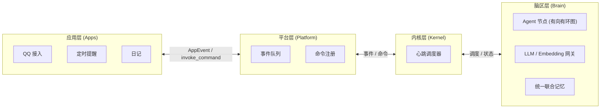

# 项目总览

AuroraBot 是一个基于 NoneBot2 框架的再封装框架, 她采用四层解耦架构：**应用层** (`apps`) 感知与执行、**平台层** (`platform`) 管理与通信、**内核层** (`kernel`) 调度与编排、**脑区层** (`brain`) 认知与记忆。

**挼挼如是说**

> AuroraBot 的核心目标是：将四层完全解耦，让 `apps/*` 负责感知世界与执行动作，让 `brain` 负责认知与记忆。并通过巧妙的架构设计，自然形成内驱式循环。

## 系统分层

| 层级       | 主要职责                                       | 关注点                     |
| ---------- | ---------------------------------------------- | -------------------------- |
| `apps`     | 感知外部输入、暴露原子命令、维护私有状态       | 接平台、接 SDK、做具体动作 |
| `platform` | 发现应用、注册命令、维护事件队列、调度生命周期 | 维护应用运行状态和生命周期 |
| `kernel`   | 注册节点、组织有向有环图、调度生命周期         | 决定下一步做什么           |
| `brain`    | Agent 节点网络、LLM 网关、统一联合记忆         | 内建认知能力               |

**展开说说**

- `apps` 层是可插拔的感知器与执行器，每个 App 通过 `manifest.yaml` 声明其自身提供的命令能力，通过 `PlatformAPI` 与宿主交互。

- `platform` 层是应用的运行时宿主，它持有**应用层的事件队列**，负责应用发现、命令注册、事件缓存与生命周期管理，并负责与上下层的双向通信。

- `kernel` 层是内核调度器，它持有**内核层的事件队列**，加载 `brain` 层的节点，管理节点的生命周期, 并负责与上下层的双向通信。

- `brain` 层采用基于有向有环图的 Agent / Router 节点网络架构，内建统一 LLM 网关、Embedding 模型网关与统一联合记忆端点，构成智能体的内建认知能力。

## 架构总览

::: tip
此图在 [系统架构总览](../architecture/system-overview.html) 中亦有记载
:::

## 当前已经具备的能力

- 已经实现部分基础应用的编写, 将在后续版本持续完善.
- 已经实现平台层所有计划内功能.
- 平台层插件体系已全线畅通.
- 已经完成内核层重要基类的编写.
- 已经完成脑区层重要基类的编写.

## 这个框架适合的场景

- 养赛博妹妹
- 养赛博女鹅
- 个人助手 (类似 AstrBot , OpenClaw)

::: tip
当前版本仅支持 QQ 接入，后续版本将支持更多平台。且个人助手的支持不是第一目标, 可能会长期搁置。
:::

## 当前边界与限制

::: warning
由于正在重构内核, 当前版本无法正常运行!!! 请知悉!!!
:::

- 脑区架构正在从线性流水线的旧内核向有向有环图结构的新内核过渡
- 统一联合记忆模块整合仍在推进中
- 脑区节点插件体系尚未开放
- 部分预装应用可能没有完整实现, 可以等待后续版本
