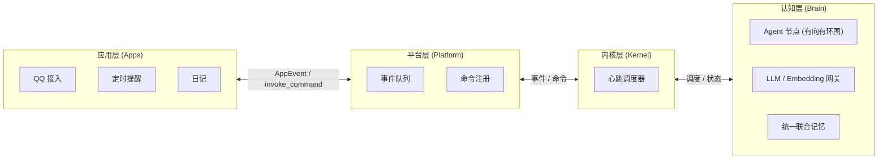

# 项目总览

AuroraBot 是一个基于 NoneBot2 框架的再封装框架, 她采用四层解耦架构：**应用层** (`apps`) 感知与执行、**平台层** (`platform`) 管理与通信、**内核层** (`kernel`) 调度与编排、**认知层** (`brain`) 认知与记忆。

**挼挼如是说**

> AuroraBot 的核心目标是：将四层完全解耦，并通过巧妙的架构设计，自然形成内驱式循环。

## 系统分层

- **`apps`** — 她的感官和手脚，负责感知世界、执行动作
- **`platform`** — 她的身体，负责把感官都安排好、让它们好好工作
- **`kernel`** — 她的心跳，负责调度节奏、编排认知事件流与组织认知内核
- **`brain`** — 她的大脑，基于文件驱动、事件总线与声明式认知拓扑网络的内核

## 架构总览

::: tip
此图在 [架构总览](../architecture/system-overview.html) 中亦有记载
:::

## 已经具备的能力

- 已经实现部分基础应用的编写, 将在后续版本持续完善.
- 已经实现平台层所有计划内功能.
- 平台层插件体系已全线畅通.
- 已经完成内核层重要基类的编写.
- 已经完成认知层重要基类的编写.

## 适合的场景

- 养赛博妹妹
- 养赛博女鹅
- 个人助手 (类似 [AstrBot](https://astrbot.app/) , [OpenClaw](https://openclaws.io/zh/))

::: tip
当前版本仅支持 QQ 接入，后续版本将支持更多平台。且个人助手的支持不是第一目标, 可能会长期搁置。
:::

## 边界与限制

::: warning
由于正在重构内核, 当前版本无法正常运行!!! 请知悉!!!
:::

- 认知架构正在从线性流水线的旧内核向有向有环图结构的新内核过渡
- 统一联合记忆模块整合仍在推进中
- 认知节点插件体系尚未开放
- 部分预装应用可能没有完整实现, 可以等待后续版本
