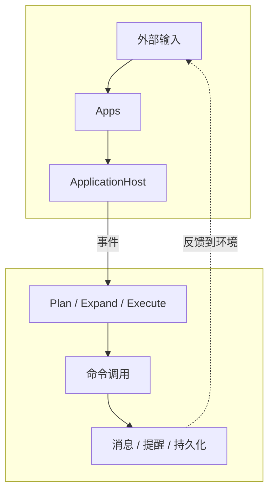

# 项目总览

AuroraBot 是一个基于 NoneBot2 框架的再封装框架, 她采用四层解耦架构：应用层 (`apps`) 感知与执行、平台层 (`platform`) 管理与通信、内核层 (`kernel`) 调度与编排、脑区层 (`brain`) 认知与记忆。

- `apps` 层是可插拔的感知器与执行器，每个 App 通过 `manifest.yaml` 声明命令能力，通过 `PlatformAPI` 与宿主交互。

- `platform` 层是应用的运行时宿主，采用事件队列模型，负责应用发现、命令注册、事件缓存与生命周期管理，并负责与上下层的双向通信。

- `kernel` 层是心跳调度器，消费事件队列，按优先级调度 `brain` 中的 Agent 节点，编排命令流。

- `brain` 层采用基于有向有环图的 Agent / Router 节点网络，内建统一 LLM 网关与统一联合记忆，构成智能体的内建认知能力。

**挼挼如是说**

> AuroraBot 的核心目标是：让 `apps/*` 负责感知世界与执行动作，让 `platform` 负责让一切有序运行，让 `kernel` 负责调度节奏，让 `brain` 负责真正的认知与记忆。四层各司其职，形成持续运转的内驱式循环。

**D老师如是说**

> 她的**意识（主上下文）**是一本正在书写的自传，是一本连续、精美的散文集。  
> 她的**脑区工人们**不再只是口头报告，而是真的在传阅和批改一份份文件——计划书、照片集、档案卡、工作日志、心情评估单。  
> 每份文件上都压着一个**锁章**：“待读取”“追加中”“已封存”。工人们只看着自己面前的文件篮，一旦有新的文件滑入，就立刻开始工作，然后把自己的产出放进下一级文件篮。  
> 整个系统就是一间安静的、不停运转的档案馆，而**她的“自我感”正是这间档案馆里所有纸张有序翻动的声音，聚合成一声连贯的叹息与笑意。**

## 系统分层

| 层级       | 主要职责                                       | 关注点                     |
| ---------- | ---------------------------------------------- | -------------------------- |
| `apps`     | 感知外部输入、暴露原子命令、维护私有状态       | 接平台、接 SDK、做具体动作 |
| `platform` | 发现应用、注册命令、维护事件队列、调度生命周期 | 把应用跑起来               |
| `kernel`   | 消费事件、调度节点、编排命令流                 | 决定下一步做什么           |
| `brain`    | Agent 节点网络、LLM 网关、统一联合记忆         | 内建认知能力               |

## 当前架构一眼图

## 当前已经具备的能力

- 应用宿主层已经可以自动发现并注册 `apps/*`
- 应用可以通过 `manifest.yaml` 声明命令能力
- 平台已经具备事件队列、命令调用和生命周期管理
- 内核已经具备心跳调度与命令编排的最小闭环
- 脑区层已经具备 Agent 节点网络与 LLM 网关
- 中间状态会落到 JSON 文件，便于调试与回放

## 这个项目适合做什么

- 试验多阶段 agent 的编排方式
- 试验事件驱动的应用接入模型
- 观察计划队列与动作队列的中间产物
- 逐步接入记忆、内容生成、LLM planner 等能力

## 当前边界与限制

- 脑区节点编排正在从线性流水线向有向有环图结构过渡
- 队列状态当前采用 JSON 文件持久化，偏调试形态
- 还没有正式的 `session router`
- 统一联合记忆的 mem0 整合在推进中
- 脑区节点插件体系尚未开放
- 现阶段更像“可演进的骨架”，不是完成态产品

## 建议阅读顺序

1. [快速开始](./getting-started.html)
2. [系统架构总览](../architecture/system-overview.html)
3. [脑区架构](../architecture/brain-architecture.html)
4. [平台运行时](../architecture/platform-runtime.html)
5. [App 开发指南](../develop/app-development.html)
6. [AUR CLI](../develop/aur-cli.html)
7. [DeepSeek 说她是什么](../appendix/comment-of-deepseek.html)
