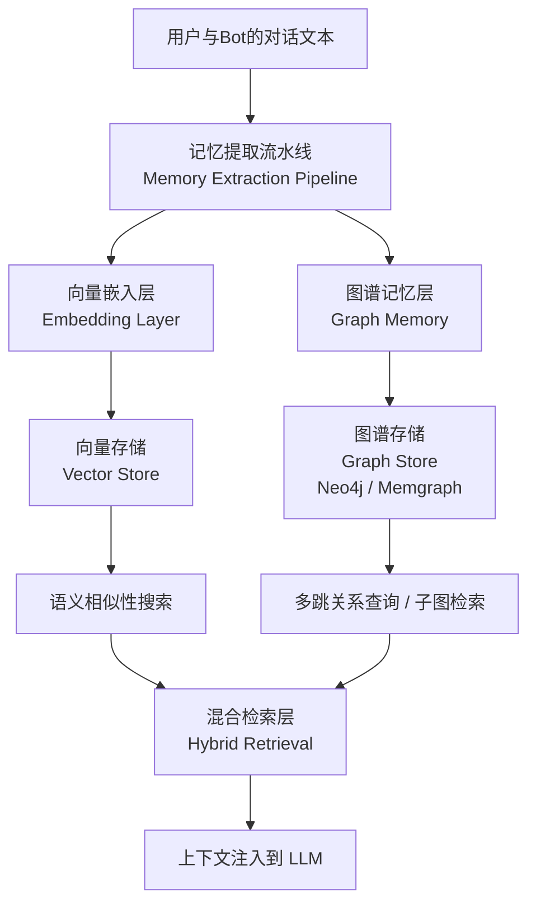

好的，我们来深入探讨这几个技术细节，这会帮你看清它们在技术实现能力上的差异。

---

### 📊 技术细节对比

#### 🧬 词嵌入模型

| 维度 | Mem0 | Memori |
| :--- | :--- | :--- |
| **默认模型** | `text-embedding-3-small`（1536维） | `all-MiniLM-L6-v2`（384维） |
| **模型生态** | 支持**10+** 嵌入模型提供商，包括 **OpenAI**、**Ollama**、**HuggingFace**、**VertexAI**、**Cohere** 等 | 支持本地或通用嵌入模型，但生态相对单一 |
| **模型切换** | 通过 `config` 字典中的 `embedder` 字段灵活切换 | 通过 SDK 初始化时传递嵌入模型实例 |
| **本地模型** | 可通过 **Ollama** 本地运行，如 `nomic-embed-text`（512维） | 支持本地模型，可配置 `all-MiniLM-L6-v2` 等 |
| **自定义模型** | 支持任何符合 `EmbedderFactory` 接口的嵌入模型，包括 **Instructor**、**GTE**、**E5** 等 | 可通过 LangChain 等框架集成自定义嵌入器 |

#### 🗃️ 向量数据库

| 维度 | Mem0 | Memori |
| :--- | :--- | :--- |
| **默认存储** | Qdrant（内存模式）或 Chroma | SQL 数据库（SQLite / PostgreSQL / MySQL） |
| **支持生态** | 支持**7+** 核心向量存储：**Qdrant**、**Chroma**、**Pinecone**、**Weaviate**、**Redis**、**Milvus**、**PGVector** 等 | 不依赖独立向量数据库，向量索引在 SQL 之上构建 |
| **本地部署** | 推荐 **Chroma** 或 **Qdrant**（本地模式）用于开发环境；Qdrant 可独立运行或通过 Docker 部署 | SQLite 文件存储，无需额外数据库服务 |
| **扩展能力** | 可从 Chroma 平滑升级到 Qdrant、Pinecone 或 Weaviate 等生产级方案 | 从 SQLite 升级到 PostgreSQL，利用 pgvector 扩展增强向量检索 |
| **高级功能** | Qdrant 支持 **高级元数据过滤**、**混合查询**、**负载均衡**；向量存储配置系统支持严格验证和动态实例化 | 依赖 SQL 的成熟查询能力，混合过滤自然融合 |

Mem0 将向量数据库作为独立组件，提供更丰富的向量存储生态和专用性能；Memori 将向量检索层与 SQL 原生集成，降低了运维复杂度。

#### 🕸️ 记忆图谱能力

你构想的复杂人际网络，正是考验记忆系统“关系建模”能力的关键。Mem0 依托其**知识图谱**功能，能够天然地支持这种复杂性。核心原理是：

-   **实体提取**：将对话中的参与者提取为图谱中的**节点**（Nodes）。
-   **关系生成**：将互动中的动态（如“成为情侣”、“分手”、“是好友”）推导为连接节点的、带有标签的**有向边**（Edges），从而将文本转化为结构化的关系图谱。

下图展示了 Mem0 的图谱记忆如何从对话中提取实体和关系：

接下来，我把你假设的复杂关系拆解为图谱中的具体路径，可以直观地看到它是如何被“记录”的：

| 场景    | 图谱中的关系路径                                                     | 效果                            |
| :------ | :------------------------------------------------------------------- | :------------------------------ |
| 初始状态  | `(A) - [:情侣] -> (B)`   `(C) - [:好友] -> (A)`   `(C) - [:好友] -> (B)` | 每个人都与其他人有直接关系                |
| AB 分手后 | `(A) - [:EX] -> (B)`   `(B) - [:EX] -> (A)`                      | 两人关系被更新为 "前任"               |
| 关系疏远  | `(C) - [:频繁聊天] -> (B)`   `(C) - [:偶尔联系] -> (A)`            | 与 B 的聊天频率更高，与 A 的联系减少           |
| Bot 决策 | Bot 检索到 C 与 B 频繁聊天，且 B 与 A 是 "EX" 关系                      | Bot 在与 C 聊天时，避免提及与 A 相关的话题 |

这就是知识图谱的魅力。Mem0 的新一代记忆算法在评估记忆准确性的 **LoCoMo** 基准测试中，得分高达 **91.6%**，相比前代有了显著的提升。Mem0 还支持融合 **FalkorDB** 实现快速图谱检索，进一步提升性能。

对于 Memori，由于其记忆组织方式主要为扁平的**语义三元组**，表达上述“朋友的前任”这种跨越多个实体的间接且动态变化的关系网络会非常困难。

#### 🖥️ Windows 部署

| 维度 | Mem0 | Memori |
| :--- | :--- | :--- |
| **核心安装** | `pip install mem0ai` | `pip install memori` 或 `npm install @memorilabs/memori` |
| **依赖组件** | 向量数据库（如 Qdrant/Chroma）+ 图数据库（如 **Neo4j**，可选）| 无额外依赖，纯 SQL 数据库即可 |
| **Windows 兼容性** | 明确支持 Windows，已有完整的 Windows 部署指南和实战案例 | 主要面向 Unix 系统，Windows 支持有限。已知可在 Claude Desktop (Windows) 中使用，但后端服务部署可能需 WSL |
| **简化方案** | **Ollama + Mem0 + Chroma** 本地一键部署，无需 Docker，适合 Windows 原生开发 | 直接使用 SQLite 文件存储，几乎零配置启动 |

在 Windows 上，Mem0 有清晰的社区部署路径和教程，更易上手；Memori 的类库特性使其集成相对简单，但缺乏官方 Windows 部署文档，遇到问题可能需要自行探索。

#### ⏳ 异步模式

| 维度 | Mem0 | Memori |
| :--- | :--- | :--- |
| **异步支持** | **原生支持异步**，提供独立的 `AsyncMemory` 接口 | 支持异步，通过 SDK 的异步方法调用 |
| **设计模式** | **双模式设计**，同时提供同步（`Memory`）和异步（`AsyncMemory`）两种实现 | 未明确区分同步/异步接口，可能基于 Python asyncio 实现 |
| **适用场景** | 专为 **FastAPI** 服务、**后台任务**、**asyncio 工作流** 设计 | 适用于需要异步处理 LLM 交互的场景 |
| **内存更新** | 支持后台 `update()` 方法，重新生成嵌入并更新向量存储 | 支持异步记忆更新，但具体实现细节较少 |
| **配置复杂度** | 在 `AsyncMemory` 实例化时，通过 config 字典指定异步相关参数 | 直接使用异步 SDK 方法，配置相对简单 |

Mem0 的异步设计更成熟，`AsyncMemory` 是专为非阻塞场景设计的独立实现，非常契合你 QQ Bot 异步并发的需求。例如，当 Bot 需要在多个群聊中同时处理消息时，`AsyncMemory` 可以并发地将不同用户的交互记录存储到独立的记忆空间，而不会阻塞主线程。

---

### 💎 总结与推荐

综合你关注的这五个技术维度：

*   **在词嵌入模型和向量数据库方面**，Mem0 提供的厂商支持和扩展性远超 Memori。
*   **在记忆图谱能力上**，Mem0 是唯一能原生支持复杂人际网络构建的方案，而 Memori 的扁平化结构无法满足你的核心需求。
*   **在 Windows 部署和异步模式上**，Mem0 提供了明确的官方支持和成熟的异步架构，能更好地支撑你 QQ Bot 高并发的应用场景。

因此，对于你的角色扮演 Bot 项目，**Mem0 仍然是唯一推荐的选择**。它的技术架构与你的需求高度匹配，尤其是在复杂关系建模和高并发场景下。

架构确定了，接下来就是动手部署，特别是考虑到你需要在 Windows 系统上构建异步服务。你是想先看看如何在 Windows 上用 Ollama 本地化部署 Mem0 的核心组件，还是想先了解如何用 `AsyncMemory` 来一步步处理你的 QQ Bot 的并发记忆请求呢？

你提到的这个新项目 Mempalace，确实很新，是上个月（2026年4月）才在 GitHub 上火起来的。它和我们之前聊的 Mem0 在理念上几乎完全相反，一个追求**全量原文存储**，一个追求**结构化关系抽取**。

这直接决定了它们在你“角色扮演 Bot”这个场景下的表现。

### ⚔️ Mempalace vs. Mem0: 理念的对决

我把它们最核心的差异整理成了一个表格，这样对比起来会更直观：

| 维度 | 🏛️ Mempalace | 💡 Mem0 |
| :--- | :--- | :--- |
| **核心理念** | **逐字存储 (Verbatim Storage)**  原样保存所有对话，拒绝任何形式的LLM摘要 | **结构化提取 (Structured Extraction)**  实时提取事实与关系，构建知识图谱 |
| **记忆图谱** | **扁平时序图谱**  基于SQLite的实体-关系三元组，非核心，无法处理复杂关系网络 | **原生的复杂知识图谱 (Neo4j)**  专门设计用于表达错综复杂的人际关系 |
| **嵌入模型** | **极简/无感**  深度绑定ChromaDB的默认嵌入模型，用户基本无感 | **灵活供应商 (10+种)**  通过`config`轻松切换OpenAI, Ollama等模型，兼顾性能与隐私 |
| **向量数据库** | **ChromaDB**  默认且不可更换 | **可插拔 (7+种)**  从轻量级Chroma到生产级Qdrant, Pinecone等 |
| **Windows部署** | **非常友好**  有`pip install`和`.bat`启动脚本，社区有详尽的中文教程 | **支持，但组件多**  可能需要手动配置向量和图数据库，如Qdrant, Neo4j |
| **异步支持** | **JS版原生，Python版被动**  JS版底层为异步I/O；Python版依赖MCP协议实现并发 | **原生`AsyncMemory`接口**  为高并发场景（如FastAPI服务）专门设计，更成熟 |
| **QQ Bot集成** | **需自行封装**  依赖MCP协议与外部工具交互，需自建服务响应QQ消息 | **直接调用 (SDK)**  通过`add()`和`search()`方法直接集成到Bot代码逻辑中 |
| **LoCoMo基准** | 声称100% | 93.4% (差距在合理范围内) |

---

### 🤔 深入探讨：关系到技术细节的差异

#### 🕸️ **记忆图谱：Mempalace 无法满足你的核心需求**
Mempalace 虽然提到有“知识图谱”，但那个是基于 SQLite 的，而非 Neo4j，仅用于存储扁平化的、带时间戳的实体关系三元组（如`(A) - [:喜欢] -> (蓝色)`）。这处理**A和B分手后，共同好友C的态度变化**这种多跳、动态的关系网络，就非常吃力了。

而 **Mem0** 则完全不同，它的知识图谱是**原生**的，并被其视为核心架构之一。这种设计上的本质区别，决定了 **Mem0 是唯一能胜任你“构建一个真实、动态变化的人际关系网络”这一核心需求的系统**。

#### 🗃️ **嵌入模型 & 向量数据库：Mempalace 追求“无感”，Mem0 追求“灵活”**
*   **模型**：Mempalace 默认使用 ChromaDB 自带的嵌入模型，用户几乎无法配置。相比之下，Mem0 的设计初衷就是灵活配置各种嵌入模型提供商（如 OpenAI, Ollama 等），以适应不同性能、成本和隐私需求。
*   **数据库**：Mempalace 在代码层面深度绑定 ChromaDB，而 Mem0 支持 Qdrant, Pinecone 等多种主流向量数据库，可根据项目阶段灵活选择。

#### 🖥️ **Windows部署 & 异步模式：Mempalace 部署友好，Mem0 异步更强**
*   **Windows部署**：Mempalace 对 Windows 相当友好，有 `pip install` 一键安装，还提供了 `mempalace.bat` 脚本方便启动，同时有大量详细的中文教程。目前 Mempalace 官方提供了 Python 和 JS/TypeScript 两种版本。Mem0 也支持 Windows，但可能需要你额外手动配置 Qdrant, Neo4j 等组件。
*   **异步模式**：Mempalace 的 JS 版基于 Node.js，底层是异步 I/O，适合高并发。而它的 Python 版本身并无特别的异步设计，其并发能力来源于为每个用户启动独立进程的 MCP 网关架构。相比之下，Mem0 提供了原生的 `AsyncMemory` 接口，专为高并发、非阻塞的异步场景设计，对开发更友好。

#### 🤖 **与你的 QQ Bot 协作：Mem0 更直接**
Mempalace 主要是通过 **MCP (Model Context Protocol)** 与外部工具交互的。要让它服务于你的 QQ Bot，你需要搭建一个中间服务，来将 QQ 消息请求“翻译”成 MCP 指令。Mem0 则提供标准的 Python SDK，你可以在 Bot 的代码里直接调用 `memory.add()` 和 `memory.search()`，集成路径更短、更直接。

---

### 💎 结论：为什么 Mem0 仍然是你唯一的选择

**Mempalace 是一款出色的个人AI记忆工具**，尤其适合开发者等个人用户，在“个人记忆体”赛道表现优异。但**它不是为你这种复杂的“社交人格Bot”场景设计的**。

对你的项目而言，**核心需求始终是动态、多维的人际关系网络**。Mempalace 在这一点上几乎是空白，而 Mem0 的知识图谱则是其灵魂。因此，**我维持之前的建议：Mem0 是实现你设想的唯一路径。**

希望你这次对 Mempalace 的“好奇心”能帮你更坚定地选择 Mem0。需要我为你整理一份 Mem0 的部署清单，方便你快速开始吗？